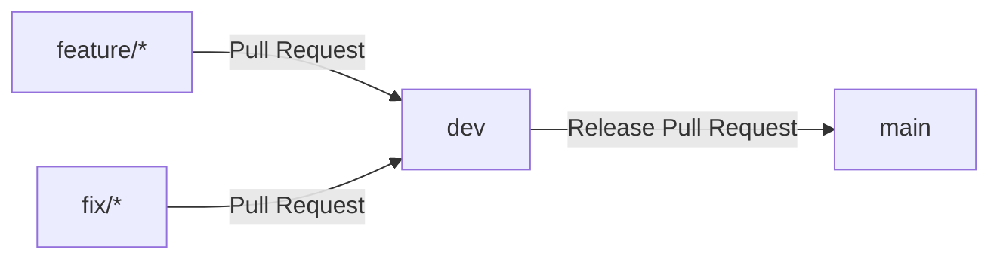
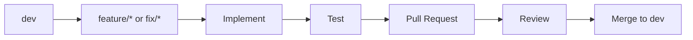
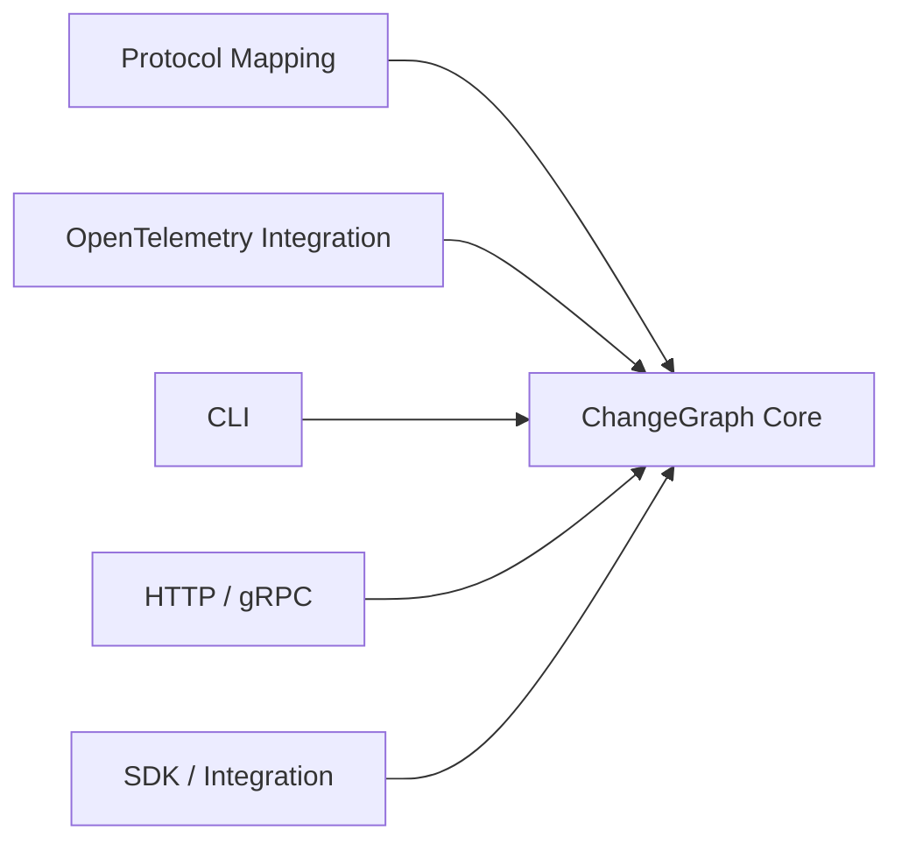
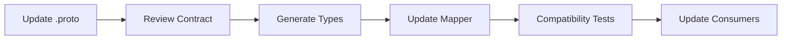
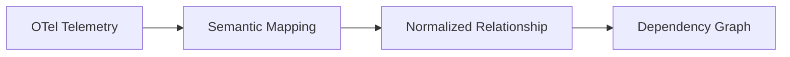
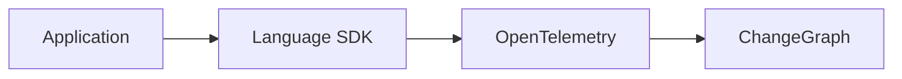
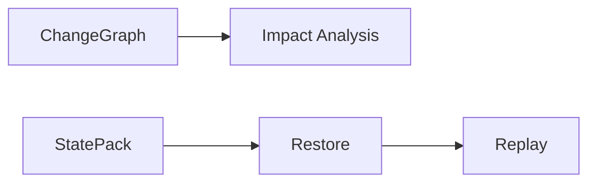
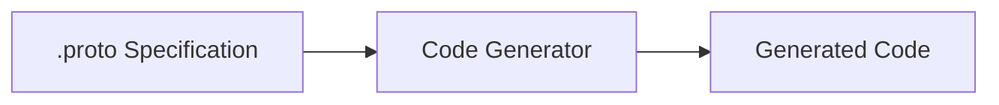
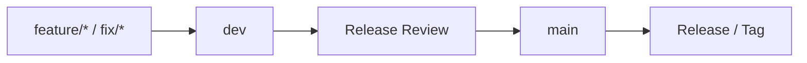

# Contributing to ChangeGraph

Thank you for contributing to ChangeGraph.

ChangeGraph is built around a language-agnostic dependency graph, OpenTelemetry integration, explicit protocol contracts, and impact analysis. Contributions should preserve these architectural boundaries and keep the core domain logic independent from interface-specific concerns.

## 1. Development Branches

ChangeGraph uses the following branch strategy:



### `main`

`main` represents the production and stable branch.

Rules:

- Do not develop directly on `main`.
- Changes should normally arrive through a pull request from `dev`.
- Production releases are created from reviewed and tested changes.

### `dev`

`dev` is the primary development and integration branch.

Rules:

- Feature and fix branches are merged into `dev`.
- Changes should remain buildable and testable.
- `dev` may contain work that is not yet ready for production.

### `feature/*`

Use `feature/*` for new functionality.

Examples:

```text
feature/graph-protocol
feature/impact-analysis
feature/otel-ingestion
feature/cli
```

Create feature branches from `dev`.

### `fix/*`

Use `fix/*` for bug fixes and corrections.

Examples:

```text
fix/protobuf-import
fix/graph-edge-validation
fix/otel-mapping
```

Create fix branches from `dev` unless the fix is specifically required for an already released production version.

---

## 2. Development Flow

The normal development workflow is:



Before starting work:

1. Update the local `dev` branch.
2. Create a focused feature or fix branch.
3. Make the smallest coherent change.
4. Add or update tests.
5. Update documentation when behavior or architecture changes.
6. Open a pull request against `dev`.

---

## 3. Branch Naming

Branch names should clearly describe the work.

Recommended patterns:

```text
feature/<short-description>
fix/<short-description>
```

Examples:

```text
feature/graph-model
feature/otel-ingestion
feature/impact-analysis
fix/edge-deduplication
fix/protobuf-import
```

Use lowercase names with hyphens where practical.

Avoid vague names such as:

```text
feature/test
feature/update
feature/new
fix/stuff
```

A branch name should make its purpose understandable without opening the branch.

---

## 4. Commit Messages

Commit messages should describe the change clearly.

The project uses a Conventional Commits-style format:

```text
<type>: <description>
```

Recommended types include:

```text
feat
fix
docs
refactor
test
build
ci
chore
```

Examples:

```text
feat: add graph edge model
fix: handle duplicate relationships
docs: document impact traversal
test: add cyclic graph fixtures
refactor: isolate protocol mapping
build: configure rust workspace
chore: update repository metadata
```

Keep the subject concise and describe the actual change.

---

## 5. Pull Requests

Every change intended for `dev` should normally be submitted through a pull request.

A pull request should explain:

- What changed
- Why it changed
- Which architectural area is affected
- How it was tested
- Whether documentation was updated
- Whether the protocol or public API changed

A useful pull request should be understandable without requiring the reviewer to reconstruct the entire development process from commits.

---

## 6. Pull Request Scope

Keep pull requests focused.

Prefer:

```text
feature/impact-analysis
```

containing the implementation and tests for impact analysis.

Avoid combining unrelated work such as:

```text
impact analysis
+ UI redesign
+ protocol rewrite
+ dependency upgrades
+ unrelated bug fixes
```

unless the changes are genuinely coupled.

Small, coherent pull requests are easier to review, test, and revert.

---

## 7. Code Review

Reviewers should consider:

### Correctness

Does the implementation behave as intended?

### Architecture

Does the change respect the existing component boundaries?

### Maintainability

Is the implementation understandable and appropriately scoped?

### Testing

Are important behaviors and edge cases covered?

### Compatibility

Does the change affect existing protocols, APIs, graph semantics, or consumers?

### Documentation

Does the documentation still describe the implemented behavior?

---

## 8. Core Architecture Rules

The ChangeGraph core contains the primary domain behavior.

The intended dependency direction is:



The core should not depend on:

- CLI presentation
- HTTP handlers
- gRPC handlers
- Language-specific SDKs
- Framework-specific application code

Graph and impact-analysis logic should remain reusable across interfaces.

---

## 9. Graph Model Changes

Changes to graph semantics require special care.

Examples include:

- Adding a node type
- Removing a node type
- Adding a relationship type
- Changing relationship semantics
- Changing node identity rules
- Changing edge deduplication behavior
- Changing impact traversal behavior

Graph-model changes should include:

1. Updated implementation.
2. Relevant tests.
3. Updated documentation.
4. Compatibility consideration where applicable.

The graph model is a foundational part of ChangeGraph, so changes should not be made only to satisfy a single integration.

---

## 10. Protocol Changes

Protocol specifications are maintained under `specs/`.

Protocol changes should be treated as contract changes.

The development flow is:



When changing a Protobuf schema:

- Do not reuse existing field numbers for different meanings.
- Prefer additive changes.
- Reserve removed fields when appropriate.
- Preserve existing semantics.
- Consider backward and forward compatibility.
- Update generated bindings when required.
- Add or update compatibility tests.

Protocol changes should be explicitly called out in the pull request.

---

## 11. OpenTelemetry Changes

OpenTelemetry integration should use existing OpenTelemetry capabilities wherever practical.

When adding or changing telemetry mapping:

1. Identify the relevant semantic attributes.
2. Define the relationship that those attributes represent.
3. Add representative telemetry fixtures.
4. Test the mapping.
5. Verify that ambiguous telemetry does not produce unsupported relationships.
6. Update the OpenTelemetry documentation when behavior changes.

The intended flow remains:



OpenTelemetry integration should not implement independent graph traversal or impact-analysis logic.

---

## 12. Testing Requirements

Changes should include appropriate tests.

### Graph Changes

Test:

- Node identity
- Node creation
- Edge creation
- Relationship types
- Relationship normalization
- Graph updates

### Impact Changes

Test:

- Direct traversal
- Upstream analysis
- Downstream analysis
- Transitive traversal
- Cycles
- Visited-node handling
- Structured results

### OpenTelemetry Changes

Test:

- Telemetry normalization
- Semantic mapping
- Relationship extraction
- Trace correlation
- Ambiguous or incomplete telemetry

### Protocol Changes

Test:

- Schema validity
- Serialization
- Deserialization
- Compatibility where applicable
- Mapping between protocol and domain models

---

## 13. Documentation Requirements

Documentation should be updated when a change affects documented behavior or architecture.

Relevant documentation includes:

```text
docs/
├── architecture.md
├── graph-model.md
├── otel-integration.md
├── protocol.md
├── statepack.md
└── development.md
```

Examples:

- A new graph relationship → update `graph-model.md`.
- A new telemetry mapping → update `otel-integration.md`.
- A protocol field change → update `protocol.md`.
- A StatePack format change → update `statepack.md`.
- A development workflow change → update `development.md`.
- A major architectural change → update `architecture.md`.

Documentation should distinguish implemented behavior from future plans.

---

## 14. Adding a New Language or SDK

New language integrations should avoid introducing language-specific behavior into the Rust core.

The preferred architecture is:



Before creating custom SDK functionality:

1. Check whether OpenTelemetry already provides the required capability.
2. Determine whether a ChangeGraph-specific feature is actually necessary.
3. Keep the integration boundary explicit.
4. Add examples and tests.
5. Document the integration.

The initial SDK ecosystem includes Node.js, PHP, and Python.

---

## 15. Adding a New Integration

A new framework or ecosystem integration should generally:

1. Use standard OpenTelemetry instrumentation when available.
2. Identify the relevant telemetry attributes.
3. Add or extend semantic mapping.
4. Add fixtures.
5. Add integration tests.
6. Add an example when appropriate.
7. Update documentation.

The core graph model should remain language-agnostic.

---

## 16. StatePack Contributions

StatePack is currently a foundation for future state capture and replay capabilities.

Changes involving StatePack should preserve the separation between:



StatePack contributions should not move state-capture responsibilities into the graph engine unless there is an explicit architectural decision to do so.

Changes to the StatePack protocol or format should document versioning and compatibility implications.

---

## 17. Generated Code

Generated code should generally not be edited manually.

For protocol-generated code:



The source specification should be changed first, followed by regeneration.

Generated artifacts should follow the repository's eventual build and source-control policy.

---

## 18. Dependencies

New dependencies should have a clear reason.

Before adding a dependency, consider:

- Does the standard library already provide the required functionality?
- Is the dependency actively maintained?
- Is the license compatible with Apache-2.0?
- Does it introduce unnecessary transitive dependencies?
- Does it materially simplify the implementation?
- Does it increase the security or maintenance burden?

Dependency additions should be mentioned in the pull request when they materially affect the project.

---

## 19. Security

Do not commit:

- API keys
- Access tokens
- Passwords
- Private keys
- Production credentials
- Sensitive production data
- Unredacted StatePack data

If a secret is accidentally committed, removing it from the latest commit is not sufficient if the secret has already been exposed. The credential should be revoked or rotated.

Security-sensitive changes should receive additional review.

---

## 20. Local Validation

Before opening a pull request, contributors should run the relevant checks.

The exact commands may evolve with the implementation, but the expected validation categories are:

```text
Format
Lint
Unit Tests
Integration Tests
Protocol Validation
Build
```

A change should not be considered ready merely because the modified file compiles in isolation.

---

## 21. Pull Request Checklist

Before opening a pull request:

```text
[ ] Branch is based on current dev
[ ] Change is scoped to one coherent purpose
[ ] Code follows the existing architecture
[ ] Relevant tests were added or updated
[ ] Relevant documentation was updated
[ ] Protocol compatibility was considered
[ ] No secrets or sensitive data were committed
[ ] Local validation passes
[ ] Commit messages are clear
```

---

## 22. Release Flow

Production releases move from `dev` to `main`.



A release should only be created from a reviewed and validated `main`.

Versioning and release conventions may become more specific as ChangeGraph approaches its first stable release.

---

## 23. Contribution Principles

ChangeGraph values:

- Clear architecture
- Small and reviewable changes
- Explicit contracts
- Reproducible tests
- Language neutrality
- OpenTelemetry interoperability
- Conservative dependency inference
- Documentation that reflects reality

The goal is not to maximize the amount of code merged.

The goal is to build a dependency-analysis system whose behavior remains understandable as the project grows.

## 24. Questions and Discussions

For architectural changes, contributors should explain the problem, proposed approach, affected boundaries, and compatibility implications before introducing a large implementation.

Major architectural decisions should be documented rather than existing only inside a pull request discussion.
