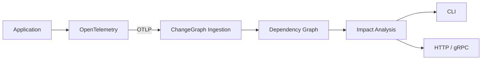
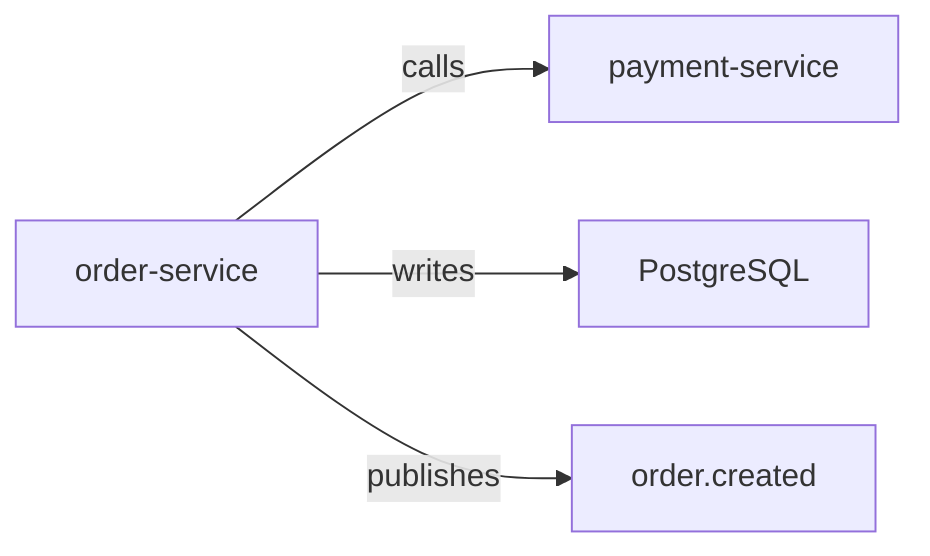
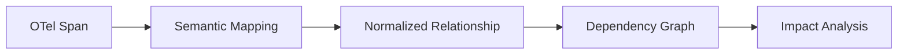
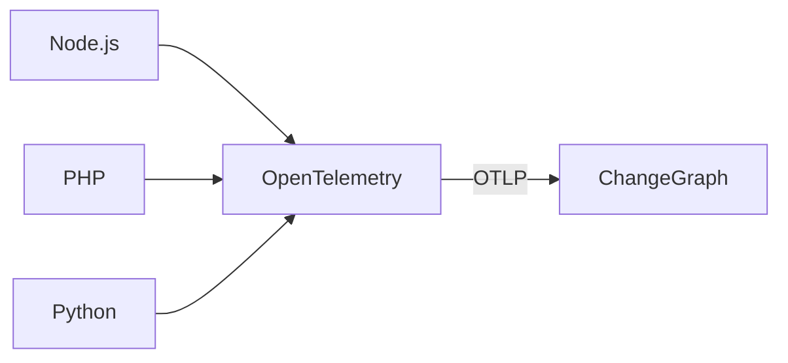
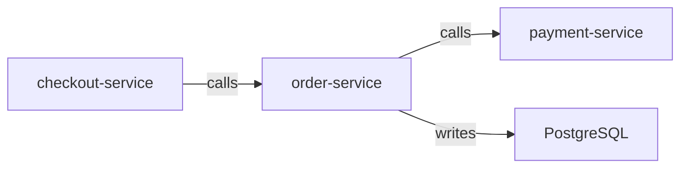
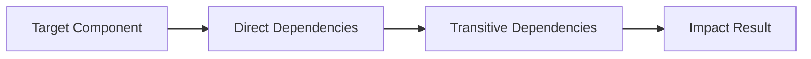
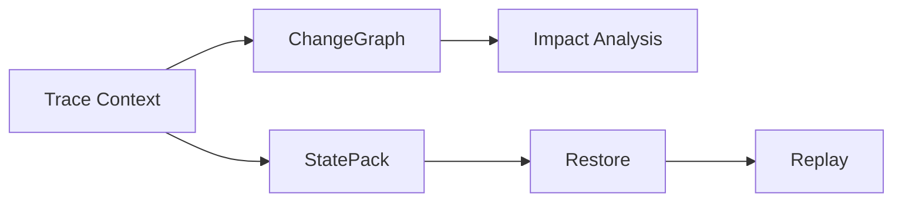
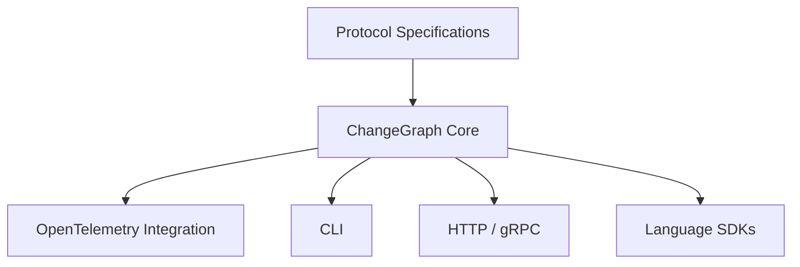
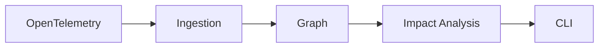
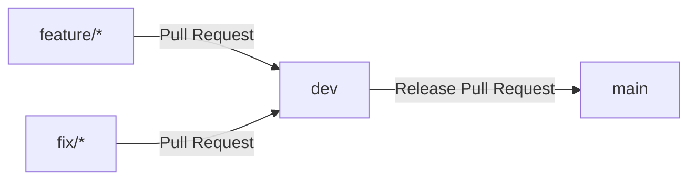

# ChangeGraph

> A language-agnostic dependency graph that turns OpenTelemetry telemetry into actionable change impact analysis.

ChangeGraph is an open-source project for understanding how application components are connected and what may be affected when a component changes.

It uses OpenTelemetry telemetry as an interoperability layer and transforms relevant observations into a normalized dependency graph.



## Why ChangeGraph?

Modern applications are distributed across services, databases, queues, events, and external systems.

A change in one component can therefore affect components that are not immediately obvious from the source code alone.

ChangeGraph is designed to make those relationships observable:



The goal is to answer questions such as:

- What does this service depend on?
- Which components may be affected by a change?
- What are the upstream dependencies of this component?
- What downstream components can be reached from it?
- What relationships were observed through telemetry?

## Core Concept

ChangeGraph separates telemetry observations from the dependency graph.



Multiple telemetry observations can contribute evidence to the same logical relationship.

This allows the graph to represent dependency structure rather than creating a separate logical dependency for every individual telemetry span.

## OpenTelemetry

OpenTelemetry provides the language-agnostic telemetry layer.

The initial ecosystem includes examples for:

- Node.js
- PHP
- Python

The intended integration is:



ChangeGraph does not attempt to replace OpenTelemetry. It consumes telemetry and interprets relevant observations as dependency relationships.

## Graph Model

The initial graph model contains directed nodes and edges.

Node categories include:

- Service
- Endpoint
- Database
- Database table
- Queue
- Topic
- Event
- External service
- Resource

Initial relationship types include:

- `calls`
- `reads`
- `writes`
- `publishes`
- `consumes`
- `depends_on`

Example:



## Impact Analysis

ChangeGraph provides graph traversal capabilities for understanding potential impact.



The initial analysis model supports:

- Direct dependency analysis
- Upstream analysis
- Downstream analysis
- Transitive traversal
- Cycle-safe traversal
- Structured impact results

The same core analysis is intended to be reusable from the CLI, HTTP API, and gRPC API.

## StatePack

StatePack is a complementary part of the ChangeGraph ecosystem.

ChangeGraph focuses on dependency understanding and impact analysis, while StatePack is intended to preserve relevant execution state for future restoration and replay workflows.



StatePack capture, restoration, and replay are future capabilities and are not required for the initial V0.1 implementation.

## Architecture

The project is built around a Rust-based core with language-neutral protocol contracts.



The core is responsible for the primary domain behavior:

- Graph model
- Ingestion model
- Impact analysis
- Protocol mapping

Interfaces such as the CLI and APIs consume the core rather than implementing separate graph logic.

## Project Status

ChangeGraph is currently in the early development stage.

The initial V0.1 direction focuses on establishing the complete path:



V0.1 focuses on the graph and telemetry foundation, rather than attempting to implement the complete long-term StatePack replay system immediately.

## Documentation

The architecture and development documentation is available in the `docs/` directory:

- [`architecture.md`](docs/architecture.md) - System and component architecture
- [`graph-model.md`](docs/graph-model.md) - Graph model and impact analysis
- [`otel-integration.md`](docs/otel-integration.md) - OpenTelemetry integration and telemetry ingestion
- [`protocol.md`](docs/protocol.md) - Protobuf and API contracts
- [`statepack.md`](docs/statepack.md) - StatePack lifecycle and format
- [`development.md`](docs/development.md) - Repository and development workflow

## Development

The project uses a Git workflow centered around:

```text
main
dev
feature/*
fix/*
```

The intended flow is:



Development should keep domain logic in the core and use protocol and integration layers as explicit boundaries.

## License

The project license will be defined in `LICENSE`.
