# ChangeGraph Architecture

## 1. Overview

ChangeGraph is a language-agnostic developer infrastructure designed to understand application dependencies and analyze the potential impact of changes across distributed systems.

ChangeGraph uses OpenTelemetry as its primary telemetry interoperability layer. Applications built with different programming languages and frameworks can send telemetry through OpenTelemetry and OTLP without requiring a ChangeGraph-specific SDK for basic dependency discovery.

The system transforms observed telemetry relationships into a dependency graph and provides impact analysis through its core engine, CLI, HTTP API, and gRPC API.

StatePack is a complementary component of the ChangeGraph ecosystem. It uses trace and context information to capture relevant application state for future restoration and replay workflows.

The primary architectural flow is represented by the system architecture diagram below.

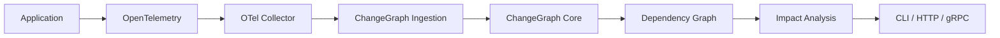

StatePack is connected through trace and context correlation:

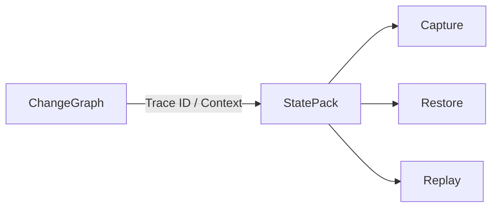

StatePack capture, restore, and replay are planned capabilities and are not part of the initial V0.1 implementation.

---

## 2. Architecture Goals

ChangeGraph follows several architectural goals.

### 2.1 Language Agnostic

Applications should be able to participate regardless of their programming language or framework.

Initial ecosystem examples include:

- Node.js
- PHP / Laravel
- Python / FastAPI

The architecture must also allow future integrations for:

- Go
- Java
- .NET
- Ruby
- Rust
- other OpenTelemetry-compatible ecosystems

Language-specific SDKs are optional integration layers, not a requirement for basic telemetry ingestion.

---

### 2.2 OpenTelemetry First

ChangeGraph does not attempt to replace OpenTelemetry.

OpenTelemetry is responsible for telemetry collection and context propagation.

ChangeGraph is responsible for interpreting relevant telemetry into dependency relationships and performing impact analysis.

The conceptual boundary is:

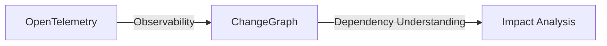

---

### 2.3 Protocol First

Cross-language interoperability is based on explicit protocols.

ChangeGraph defines its own protocol contracts using Protocol Buffers for communication between its components and integrations.

The repository contains the following protocol specifications:

- `specs/graph/graph.proto`
- `specs/ingest/ingest.proto`
- `specs/statepack/statepack.proto`

OpenTelemetry and OTLP remain the interoperability standard for telemetry entering the system.

ChangeGraph Protocol defines the contracts specific to ChangeGraph.

These are separate concerns and should not be conflated.

---

### 2.4 Core Independence

The ChangeGraph core must not depend on the CLI, HTTP API, gRPC API, or a particular programming language ecosystem.

The core contains the primary domain logic:

- Graph
- Ingestion Model
- Impact Analysis
- Protocol Mapping

Interfaces such as CLI, HTTP, and gRPC act as adapters around the core.

---

### 2.5 Deterministic Analysis

The initial impact analysis engine should be deterministic.

Given the same graph and the same analysis parameters, the engine should produce the same result.

V0.1 does not require AI or machine learning for impact analysis.

AI-based explanation or ranking may be considered as a future layer, but it must not become the source of truth for graph relationships.

---

## 3. System Architecture

The system consists of five major architectural areas:

1. Application and OpenTelemetry layer
2. Telemetry ingestion layer
3. ChangeGraph core
4. Developer interfaces
5. StatePack ecosystem

### 3.1 System Diagram

```
flowchart TB

    subgraph APPS["Applications"]
        NODE["Node.js"]
        PHP["PHP / Laravel"]
        PYTHON["Python / FastAPI"]
        GO["Go"]
        OTHER["Other Ecosystems"]
    end

    subgraph OTEL["OpenTelemetry Layer"]
        SDK["OpenTelemetry SDK"]
        COLLECTOR["OpenTelemetry Collector"]
    end

    subgraph CHANGEGRAPH["ChangeGraph"]
        RECEIVER["OTel Receiver"]
        MAPPER["Telemetry Mapper"]
        CORE["ChangeGraph Core"]
        GRAPH["Graph Engine"]
        IMPACT["Impact Analyzer"]
    end

    subgraph INTERFACES["Developer Interfaces"]
        CLI["CLI"]
        HTTP["HTTP API"]
        GRPC["gRPC API"]
    end

    subgraph STATEPACK["StatePack"]
        SP["StatePack Engine"]
        CAPTURE["Capture"]
        RESTORE["Restore"]
        REPLAY["Replay"]
    end

    NODE --> SDK
    PHP --> SDK
    PYTHON --> SDK
    GO --> SDK
    OTHER --> SDK

    SDK -->|"OTLP"| COLLECTOR
    COLLECTOR -->|"OTLP"| RECEIVER

    RECEIVER --> MAPPER
    MAPPER --> CORE

    CORE --> GRAPH
    CORE --> IMPACT

    CORE --> CLI
    CORE --> HTTP
    CORE --> GRPC

    CORE -. "Trace ID / Context" .-> SP

    SP --> CAPTURE
    SP --> RESTORE
    SP --> REPLAY

```

### 3.2 System Components

#### Applications

Applications are the systems being observed.

They may use different languages, frameworks, databases, messaging systems, and deployment environments.

ChangeGraph does not require applications to be rewritten around a specific architecture.

---

#### OpenTelemetry Layer

The OpenTelemetry layer provides standardized telemetry instrumentation and transport.

The primary transport into ChangeGraph is OTLP.

The OpenTelemetry Collector acts as an intermediary between application telemetry and ChangeGraph when deployed in a collector-based architecture.

---

#### OTel Receiver

The receiver accepts telemetry from the OpenTelemetry pipeline.

Its responsibility is to receive telemetry, not to perform impact analysis.

---

#### Telemetry Mapper

The mapper interprets relevant OpenTelemetry information and converts it into ChangeGraph concepts.

For example:

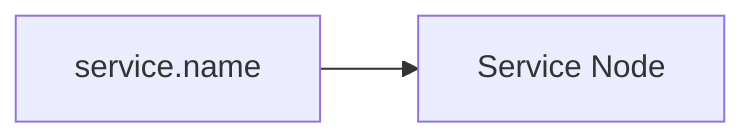

and:

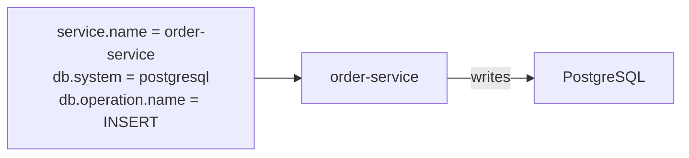

The mapper is responsible for translating observations into relationships.

---

#### ChangeGraph Core

The core is the primary domain engine of ChangeGraph.

It contains:

- Graph
- Ingest
- Impact Analysis
- Protocol Mapping

The core must remain independent from external interfaces.

---

#### Graph Engine

The graph engine manages nodes and edges representing discovered dependencies.

Example:

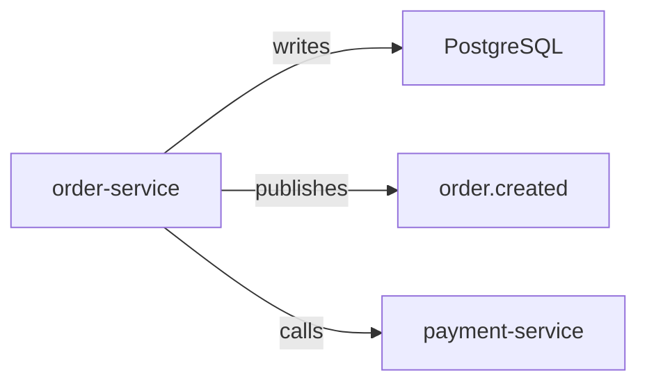

The graph is a derived representation of application relationships.

Telemetry is the observation source; the graph is the dependency model derived from those observations.

---

#### Impact Analyzer

The impact analyzer traverses the dependency graph to determine which components may be affected by a selected node, relationship, or change.

The initial implementation uses deterministic graph traversal.

Example:

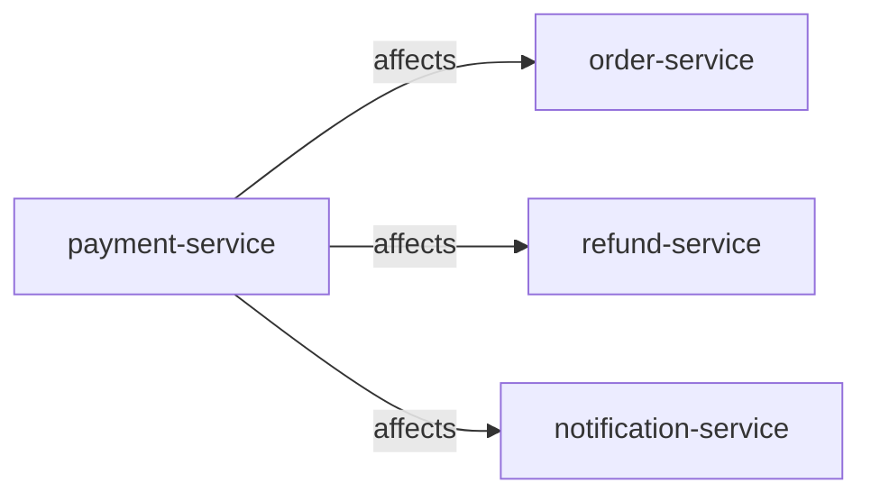

More advanced risk scoring and semantic analysis can be added later without changing the fundamental graph model.

---

#### Developer Interfaces

ChangeGraph exposes its capabilities through:

```
CLI
HTTP API
gRPC API

```

These interfaces must delegate domain operations to the ChangeGraph core.

They must not implement independent graph or impact-analysis logic.

---

## 4. Components Architecture

The internal ChangeGraph core is divided into four primary modules:

- `core/rust/src/graph/`
- `core/rust/src/ingest/`
- `core/rust/src/impact/`
- `core/rust/src/protocol/`

### 4.1 Component Diagram

```
flowchart TB

    subgraph CORE["ChangeGraph Core"]

        subgraph GRAPH_MODULE["Graph Module"]
            NODE["Node"]
            EDGE["Edge"]
            GRAPH_ENGINE["Graph"]
        end

        subgraph INGEST_MODULE["Ingest Module"]
            TRACE["Trace"]
            SPAN["Span"]
            RELATIONSHIP["Relationship Extraction"]
        end

        subgraph IMPACT_MODULE["Impact Module"]
            TRAVERSAL["Graph Traversal"]
            ANALYZER["Impact Analyzer"]
            RESULT["Impact Result"]
        end

        subgraph PROTOCOL_MODULE["Protocol Module"]
            PROTO["Protobuf Contracts"]
            MAPPER_PROTO["Protocol Mapper"]
        end
    end

    TRACE --> SPAN
    SPAN --> RELATIONSHIP

    RELATIONSHIP --> NODE
    RELATIONSHIP --> EDGE

    NODE --> GRAPH_ENGINE
    EDGE --> GRAPH_ENGINE

    GRAPH_ENGINE --> TRAVERSAL
    TRAVERSAL --> ANALYZER
    ANALYZER --> RESULT

    PROTO --> MAPPER_PROTO
    MAPPER_PROTO --> TRACE
    MAPPER_PROTO --> NODE
    MAPPER_PROTO --> EDGE

```

---

## 5. Module Responsibilities

### 5.1 `graph/`

Responsible for the internal dependency graph representation.

Main responsibilities:

- Node representation
- Edge representation
- Graph storage
- Graph mutation
- Graph lookup

The module must not know how telemetry was originally collected.

---

### 5.2 `ingest/`

Responsible for representing and processing incoming trace/span information before it becomes graph relationships.

Main responsibilities:

- Trace representation
- Span representation
- Telemetry-derived relationship extraction
- Ingestion normalization

The module does not perform final impact analysis.

---

### 5.3 `impact/`

Responsible for analyzing the dependency graph.

Main responsibilities:

- Graph traversal
- Upstream analysis
- Downstream analysis
- Dependency analysis
- Impact result generation

The initial implementation should remain deterministic.

---

### 5.4 `protocol/`

Responsible for mapping between ChangeGraph protocol representations and internal domain models.

Main responsibilities:

- Protocol mapping
- Serialization/deserialization boundaries
- Protocol compatibility
- Mapping generated Protobuf structures into internal models

The protocol layer must not become the location for business rules.

---

## 6. Dependency Direction

The architectural dependency direction is:

```
flowchart LR

    OTEL["OpenTelemetry Integration"]
    API["HTTP / gRPC API"]
    CLI["CLI"]
    SDK["Language SDKs"]

    CORE["ChangeGraph Core"]

    GRAPH["Graph"]
    INGEST["Ingest"]
    IMPACT["Impact"]
    PROTOCOL["Protocol"]

    OTEL --> CORE
    API --> CORE
    CLI --> CORE
    SDK --> PROTOCOL

    CORE --> GRAPH
    CORE --> INGEST
    CORE --> IMPACT
    CORE --> PROTOCOL

```

The important dependency rule is:

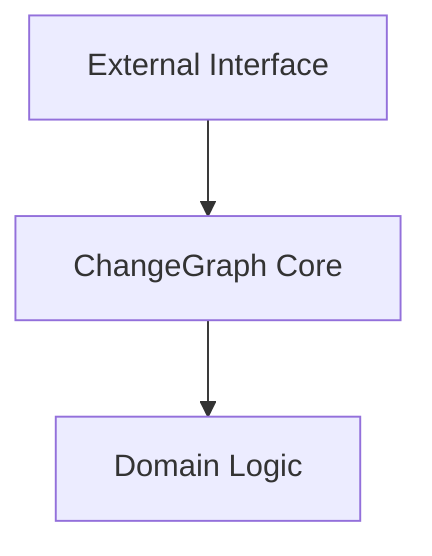

The inverse dependency is not allowed:

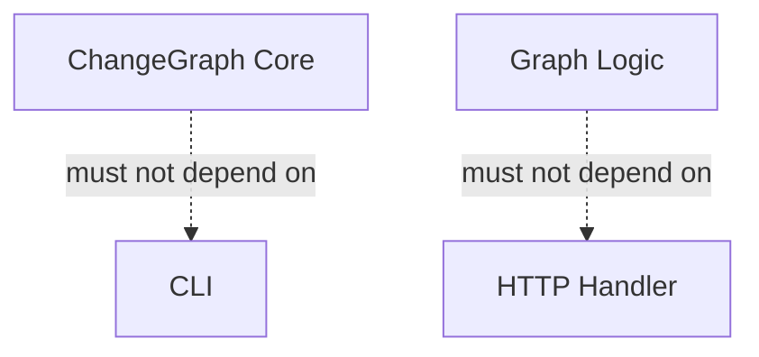

This keeps the core reusable across interfaces.

---

## 7. StatePack Architectural Boundary

StatePack is part of the ChangeGraph ecosystem but is intentionally separated from the core graph engine.

The conceptual relationship is:

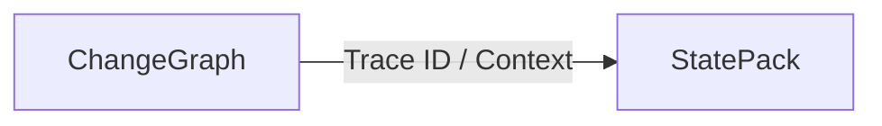

ChangeGraph answers:

> What components are related and potentially affected?

StatePack answers:

> What application state existed when a relevant event occurred?

### 7.1 StatePack Boundary

```
flowchart LR

    CG["ChangeGraph"]

    TRACE["Trace ID / Context"]

    SP["StatePack"]

    CAPTURE["Capture"]
    RESTORE["Restore"]
    REPLAY["Replay"]

    CG --> TRACE
    TRACE --> SP

    SP --> CAPTURE
    SP --> RESTORE
    SP --> REPLAY

```

StatePack capture, restoration, and replay are planned capabilities beyond the initial V0.1 implementation.

---

## 8. Core Architectural Principles

### OpenTelemetry-first

Use OpenTelemetry and OTLP for standardized telemetry interoperability instead of creating a competing telemetry protocol.

### Language-agnostic

Do not make the core dependent on a particular application language or framework.

### Protocol-first

Define cross-component contracts explicitly using versioned schemas.

### Core-first

Keep domain logic inside the core and expose it through adapters.

### Deterministic

Impact analysis must produce reproducible results from identical graph state and analysis parameters.

### Separation of concerns

Telemetry collection, graph construction, impact analysis, developer interfaces, and state capture must remain separate architectural concerns.

### Extensible

New language SDKs, telemetry sources, graph storage strategies, and analysis algorithms should be addable without redesigning the entire system.

---

## 9. V0.1 Architecture Scope

V0.1 focuses on proving the core ChangeGraph workflow:

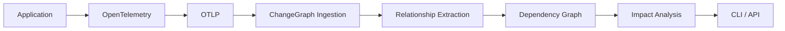

V0.1 includes:

- Core graph model
- Trace/span ingestion model
- OpenTelemetry integration
- Relationship extraction
- Deterministic graph traversal
- Impact analysis
- CLI
- Protocol definitions
- Initial language examples

V0.1 does not require:

- Full StatePack capture
- State restoration
- Deterministic replay
- AI-based analysis
- Advanced risk prediction
- Production-scale distributed graph storage

These capabilities may be introduced in later versions.

---

## 10. Future Architecture Direction

The long-term architecture extends the V0.1 pipeline with StatePack:

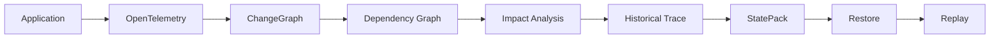

The goal is to eventually connect **change understanding** with **incident reproduction**:

```text
ChangeGraph: "What could this change affect?"
StatePack: "What exact state caused this behavior?"
```

Together, these capabilities form the long-term ChangeGraph ecosystem without coupling StatePack's implementation to the graph engine itself.