# ChangeGraph Development

## 1. Overview

This document describes the development structure and workflow for ChangeGraph.

The repository is organized around a Rust-based core, OpenTelemetry integration, protocol specifications, developer interfaces, language SDKs, StatePack foundations, examples, tests, and documentation.

Development follows a dependency-first approach:

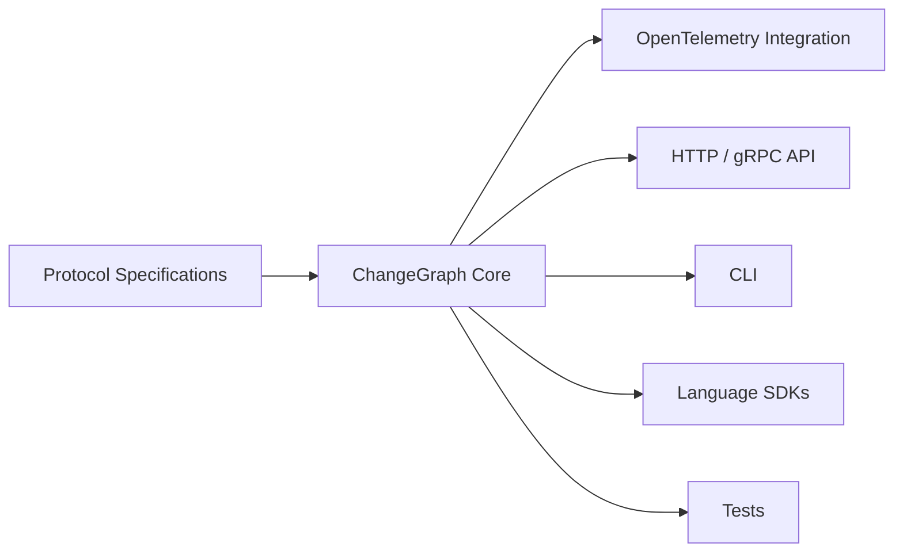

The core domain logic should be established before interfaces that consume it.

---

## 2. Repository Structure

The repository contains the following major areas:

- `specs/` - protocol definitions
- `core/` - ChangeGraph domain engine
- `otel/` - OpenTelemetry integration
- `api/` - HTTP and gRPC interfaces
- `cli/` - command-line interface
- `sdk/` - language-specific integrations
- `statepack/` - StatePack foundations
- `examples/` - integration examples
- `tests/` - test suites and fixtures
- `docs/` - project documentation

The root project is managed as a Rust workspace.

---

## 3. Rust Workspace

The Rust implementation is divided into independently buildable packages where appropriate.

The primary Rust packages are:

- ChangeGraph core
- ChangeGraph CLI

The dependency direction is:

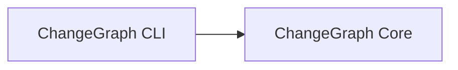

The CLI consumes the core.

The core must not depend on the CLI.

This keeps the domain engine reusable by future interfaces such as HTTP, gRPC, language bindings, or other developer tools.

---

## 4. Core Development

The ChangeGraph core is implemented in Rust.

The core is responsible for the primary domain behavior:

- Graph model
- Trace and span ingestion model
- Impact analysis
- Protocol mapping

The core should remain independent from presentation concerns.

The development boundary is:

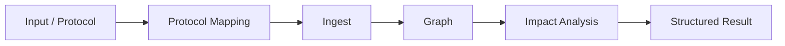

The core should return structured domain results rather than CLI-specific strings.

---

## 5. OpenTelemetry Development

OpenTelemetry integration is an adapter around the core.

Its responsibility is to:

- Receive telemetry
- Normalize telemetry
- Interpret semantic attributes
- Extract relationships
- Pass normalized information into the core

The intended flow is:

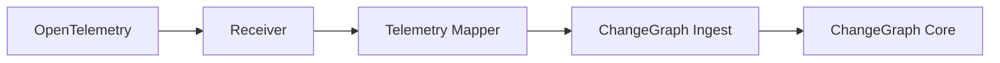

OpenTelemetry integration should not implement independent graph traversal or impact-analysis algorithms.

---

## 6. CLI Development

The CLI provides a developer-facing interface to ChangeGraph.

The CLI is organized around commands and output handling.

Its responsibilities include:

- Parse command-line arguments
- Invoke core operations
- Render structured results
- Provide useful developer feedback

The conceptual flow is:

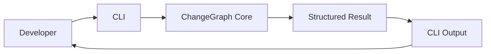

The CLI should not duplicate core domain logic.

For example, the `impact` command should invoke the core impact analyzer rather than implementing its own graph traversal.

---

## 7. API Development

HTTP and gRPC APIs expose ChangeGraph capabilities to external tools and services.

The API layer should act as an adapter around the core.

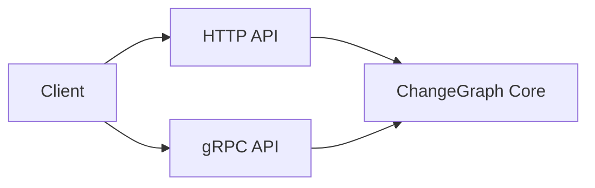

API handlers should:

1. Validate incoming requests.
2. Map requests to core operations.
3. Execute the domain operation.
4. Map structured results into the API response.
5. Return the response.

The API layer should not own graph state or implement independent impact-analysis logic.

---

## 8. Protocol Development

Protocol definitions are maintained under `specs/`.

Protocol changes should follow this flow:

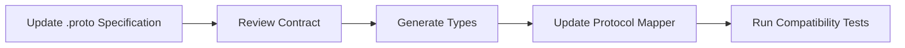

Protocol specifications are the source of truth for wire contracts.

Generated code is an implementation artifact.

A protocol change should be treated as an API change, even when the change originates from an internal development task.

---

## 9. Testing Strategy

ChangeGraph uses multiple levels of testing.

The repository separates tests into:

- Fixtures
- Graph tests
- Impact tests
- OpenTelemetry tests

The testing architecture is:

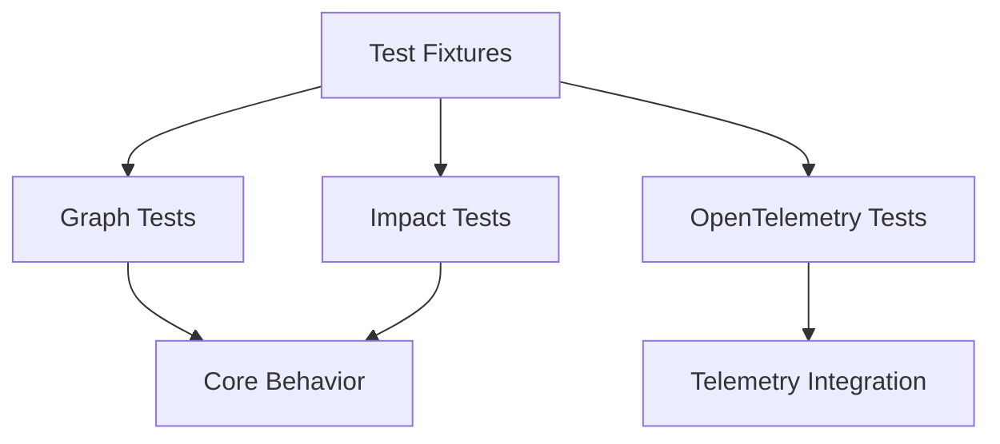

### 9.1 Graph Tests

Graph tests validate:

- Node creation
- Edge creation
- Node identity
- Edge relationships
- Graph updates
- Graph lookup
- Relationship normalization

### 9.2 Impact Tests

Impact tests validate:

- Direct traversal
- Upstream analysis
- Downstream analysis
- Transitive traversal
- Cycles
- Visited-node handling
- Structured impact results

### 9.3 OpenTelemetry Tests

OpenTelemetry tests validate:

- Telemetry ingestion
- Semantic attribute mapping
- Relationship extraction
- Trace correlation
- Telemetry normalization

Fixtures should represent realistic telemetry cases without requiring a production environment.

---

## 10. Development Flow

A normal development cycle follows:

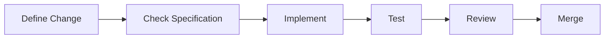

For changes that affect a protocol or public behavior, the specification and compatibility implications should be considered before implementation.

---

## 11. Feature Development Order

A feature that affects the core should generally be implemented in this order:

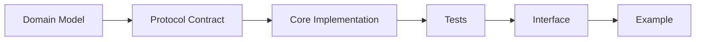

Not every feature requires every stage.

However, the dependency direction should remain consistent.

For example, a new impact-analysis capability should be implemented in the core before adding a CLI command that exposes it.

---

## 12. Adding a New SDK

Language-specific SDKs are integration layers.

The initial SDK ecosystem contains:

- Node.js
- PHP
- Python

A new SDK should not require changes to the fundamental graph model merely because a new language is added.

The intended flow is:

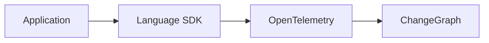

The SDK should prefer existing OpenTelemetry instrumentation where possible.

A ChangeGraph-specific SDK should only add functionality that cannot reasonably be provided through standard OpenTelemetry mechanisms.

---

## 13. Adding a New Integration

A new framework, language, or telemetry integration should generally follow:

1. Determine whether OpenTelemetry already provides the required instrumentation.
2. Identify the relevant semantic attributes.
3. Define or extend the mapping rules.
4. Add representative fixtures.
5. Add integration tests.
6. Update documentation.
7. Add an example when the integration is intended for public use.

The objective is to avoid creating unnecessary ecosystem-specific logic inside the core.

---

## 14. Examples

Examples demonstrate how external applications interact with ChangeGraph.

The initial examples are organized by ecosystem:

- Node.js
- PHP
- Python

Examples should remain small and focused.

A good example should demonstrate:

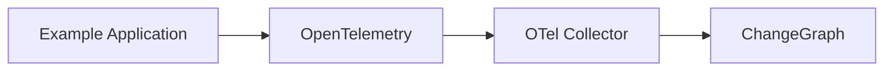

Examples should not become production application templates.

---

## 15. StatePack Development

StatePack is a separate development track from the V0.1 ChangeGraph graph engine.

Its current role is to establish:

- Protocol
- Manifest
- Format concepts
- Security requirements
- Trace correlation

The future development path is:

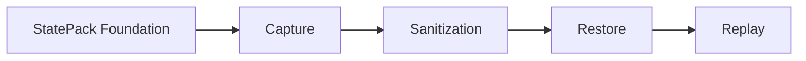

Capture, restore, and replay should not be introduced into the V0.1 core merely to satisfy the existence of the StatePack directories.

---

## 16. Documentation Development

Documentation is part of the development process.

The primary documentation files are:

- `architecture.md`
- `graph-model.md`
- `otel-integration.md`
- `protocol.md`
- `statepack.md`
- `development.md`

Architecture-changing implementation work should update the relevant documentation when the documented behavior changes.

Documentation should describe actual implemented behavior separately from planned functionality.

---

## 17. Change Classification

Changes should be classified before implementation.

### Documentation Change

Changes only explanations, examples, or diagrams.

### Internal Change

Changes implementation details without changing external behavior.

### Protocol Change

Changes a `.proto` schema or wire-level contract.

### API Change

Changes HTTP, gRPC, CLI, or SDK behavior.

### Graph Model Change

Changes node, edge, relationship, or graph semantics.

### Compatibility Change

Changes behavior that may affect existing consumers.

Protocol, API, graph-model, and compatibility changes require more careful review than ordinary internal refactors.

---

## 18. Testing Before Merge

Before a change is merged, the relevant validation should pass.

For core changes:

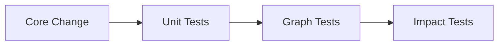

For OpenTelemetry changes:

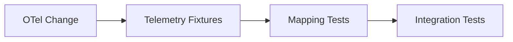

For protocol changes:

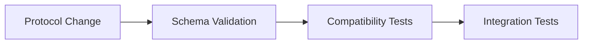

The exact commands may evolve as the implementation matures.

---

## 19. V0.1 Development Scope

V0.1 development focuses on the smallest complete path through the architecture:

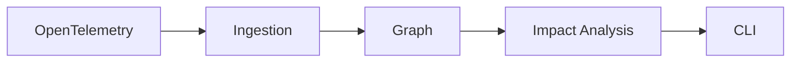

The V0.1 implementation should establish:

- Rust core
- Graph model
- Ingestion model
- Impact analysis
- Protocol foundation
- OpenTelemetry integration
- CLI
- Initial tests
- Initial ecosystem examples

StatePack capture, restoration, and replay remain future work.

---

## 20. Development Principles

### Core First

Implement domain behavior before interface-specific behavior.

### One Source of Truth

Graph and impact logic belong to the core.

### Protocol Explicitness

Cross-component contracts belong in the protocol specifications.

### Test Behavior

Tests should validate observable behavior and domain invariants.

### OpenTelemetry Reuse

Use existing OpenTelemetry capabilities before creating custom instrumentation.

### Conservative Inference

Do not create graph relationships when telemetry does not provide sufficient evidence.

### Incremental Ecosystem Growth

Add languages and frameworks without changing the fundamental core architecture.

### Document Reality

Documentation must distinguish implemented behavior from planned architecture.

---

## 21. Contribution Workflow

Contributors should generally:

1. Understand the relevant architecture and module boundary.
2. Identify whether the change affects a protocol, graph model, API, or internal implementation.
3. Update the appropriate specification when required.
4. Implement the smallest coherent change.
5. Add or update tests.
6. Update documentation when behavior or architecture changes.
7. Run the relevant validation.
8. Submit the change for review.

The project should prefer small, reviewable changes over large architectural rewrites.

Additional contribution rules are defined in `CONTRIBUTING.md`.

---

## 22. Future Development Direction

The long-term development path connects dependency analysis with reproducible debugging:

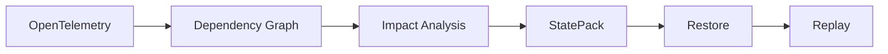

The development strategy is to establish each architectural boundary independently before combining them into a larger workflow.

This keeps the V0.1 implementation focused while preserving a clear path toward the broader ChangeGraph ecosystem.
