# ChangeGraph Graph Model

## 1. Overview

The ChangeGraph graph is the internal dependency model derived from application telemetry and explicit relationship metadata.

The graph represents components and the relationships observed between them. It is designed to answer dependency and impact questions without coupling the graph model to a specific programming language or framework.

The fundamental model is:

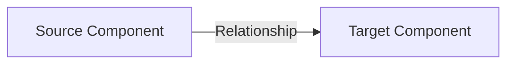

A graph is composed of:

- Nodes
- Edges
- Relationship metadata
- Observation metadata

The graph is a derived model. OpenTelemetry telemetry provides observations, while ChangeGraph converts those observations into normalized graph relationships.

---

## 2. Graph Model

A ChangeGraph graph consists of nodes connected by directed edges.

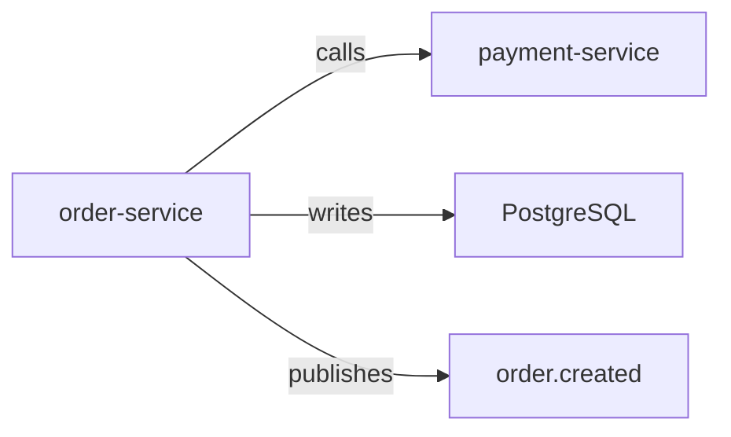

The direction of an edge is significant.

For example:

```text
order-service → payment-service
```

means that the source component has a relationship toward the target component.

The graph must preserve relationship direction because impact analysis depends on traversing relationships in a specific direction.

---

## 3. Node Model

A node represents an identifiable component or resource in an application ecosystem.

Initial node categories include:

- Service
- Endpoint
- Database
- Database table
- Queue
- Topic
- Event
- External service
- Other explicitly modeled resources

A node should have a stable identity.

Conceptually:

```text
Node
├── identity
├── type
├── attributes
└── metadata
```

The implementation must distinguish node identity from descriptive attributes.

For example, changing a display name should not implicitly create a completely unrelated node when the underlying identity remains the same.

### 3.1 Service Node

Example:

```text
type = service
identity = service:order
```

A service can have relationships to:

- Other services
- Databases
- Queues
- Events
- External systems

### 3.2 Database Node

Example:

```text
type = database
identity = database:postgresql/shop
```

A database may be refined with additional resource information such as a namespace or table.

### 3.3 Resource Nodes

Resources such as queues, topics, external APIs, and tables can be represented as dedicated nodes when sufficient telemetry or explicit metadata exists.

The graph model should not require every possible technology to have a unique node type. New resource categories can be introduced through the protocol without redesigning the entire graph engine.

---

## 4. Edge Model

An edge represents a directed relationship between two nodes.

The initial relationship vocabulary includes:

| Relationship | Meaning |
|---|---|
| `calls` | Source invokes or communicates with target |
| `reads` | Source reads data from target |
| `writes` | Source writes data to target |
| `publishes` | Source publishes an event/message to target |
| `consumes` | Source consumes an event/message from target |
| `depends_on` | Source has an explicit dependency on target |

Example:


Edges are directional.

The same pair of nodes may have different relationship types when the observed behavior justifies them.

For example:

```text
order-service → payment-service
```

may represent a `calls` relationship, while another relationship between the same components could represent a separate dependency declared by the application.

---

## 5. Relationship Metadata

An edge can contain metadata describing how and where the relationship was observed.

Conceptually:

```text
Edge
├── source
├── target
├── relationship_type
├── attributes
└── observations
```

Possible observation metadata includes:

- Trace identifier
- Span identifier
- Timestamp
- Source service
- Runtime attributes
- Protocol attributes
- Telemetry attributes

The exact wire representation is defined by the ChangeGraph protocol rather than being hard-coded into the graph documentation.

---

## 6. Graph Semantics

ChangeGraph separates three concepts:

### Observation

Something observed through telemetry.

Example:

```text
order-service
performed
INSERT
on
PostgreSQL
```

### Relationship

A normalized dependency inferred from the observation.

```text
order-service --writes--> PostgreSQL
```

### Graph

The accumulated set of normalized nodes and relationships.

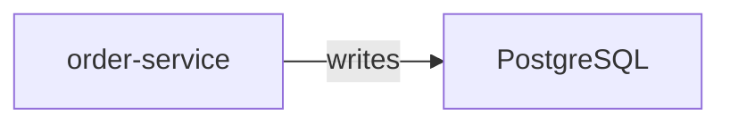

This separation is important because multiple telemetry observations may describe the same underlying relationship.

The graph should therefore represent the relationship rather than blindly creating a new edge for every span.

---

## 7. Relationship Extraction

The ingestion layer converts telemetry information into graph relationships.

A simplified transformation is:

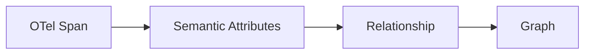

Example:

```text
service.name = order-service
db.system = postgresql
db.operation.name = INSERT
```

can produce:

```text
order-service --writes--> PostgreSQL
```

HTTP or RPC telemetry can produce relationships such as:

```text
order-service --calls--> payment-service
```

Messaging telemetry can produce relationships such as:

```text
order-service --publishes--> order.created
```

and:

```text
notification-service --consumes--> order.created
```

The exact mapping rules belong to the OpenTelemetry integration and protocol layers.

---

## 8. Graph Lifecycle

The graph evolves as new observations are ingested.

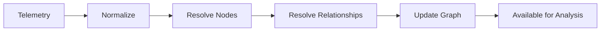

The lifecycle is:

1. Receive telemetry.
2. Normalize relevant telemetry attributes.
3. Resolve source and target node identities.
4. Determine the relationship type.
5. Create or update the corresponding nodes and edge.
6. Make the updated graph available to analysis.

The graph should not depend on the lifetime of an individual span. A span is an observation; the graph is the resulting dependency representation.

---

## 9. Impact Analysis

Impact analysis traverses the graph from a selected target.

The initial analysis model distinguishes several directions.

### 9.1 Downstream Impact

Downstream analysis follows relationships from the selected node toward its targets.

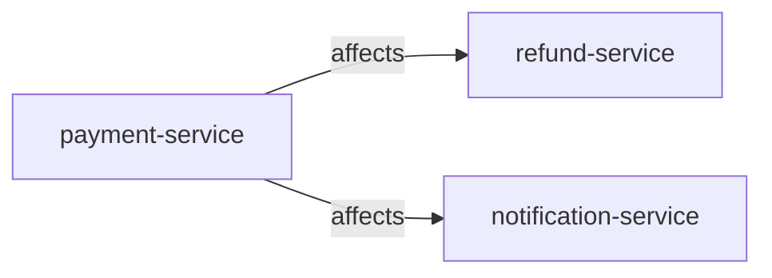

A downstream query asks:

> Which components may be affected by this component?

### 9.2 Upstream Dependencies

Upstream analysis follows relationships toward components that depend on the selected node.

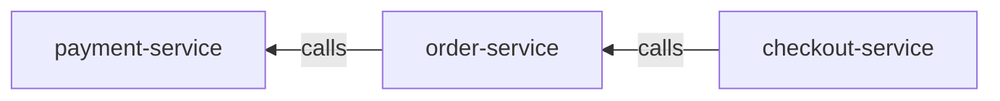

For `payment-service`, upstream analysis can identify:

```text
order-service
checkout-service
```

### 9.3 Direct Dependencies

Direct dependency analysis returns immediate graph neighbors without recursively traversing the complete graph.

### 9.4 Transitive Impact

Transitive analysis recursively traverses relationships to discover indirect dependencies.

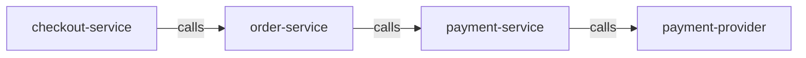

A change to `payment-service` can therefore have implications for components that reach it through multiple relationship levels.

---

## 10. Impact Traversal

The initial traversal model is deterministic.

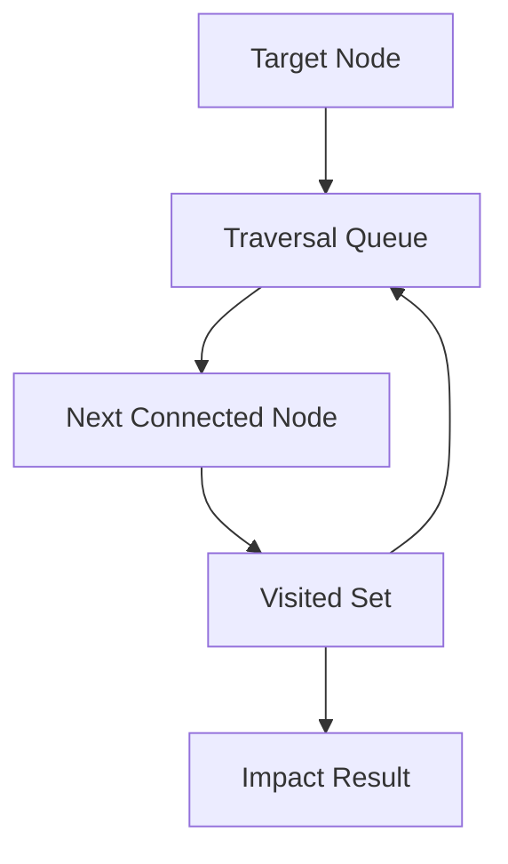

The traversal must track visited nodes to prevent repeated traversal and cycles from causing unbounded processing.

For example:

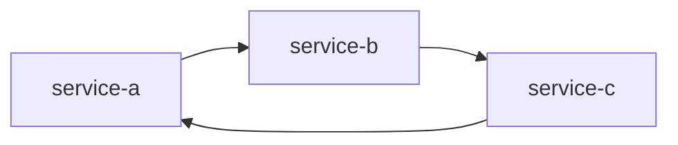

A traversal starting from `service-a` must terminate even though the graph contains a cycle.

---

## 11. Impact Result

The impact analyzer should return structured results rather than only formatted text.

Conceptually:

```text
Impact Result
├── target
├── direction
├── affected nodes
├── relationship paths
└── analysis metadata
```

The CLI, HTTP API, and gRPC API can then render or serialize the same underlying result.

This keeps presentation separate from analysis.

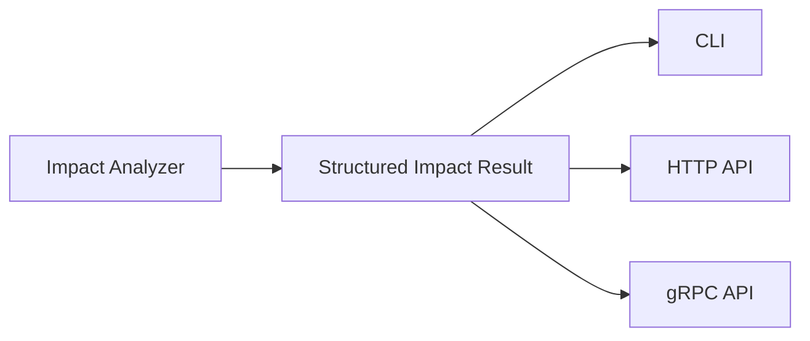

---

## 12. Sequence: Impact Analysis

The impact analysis request follows this sequence:

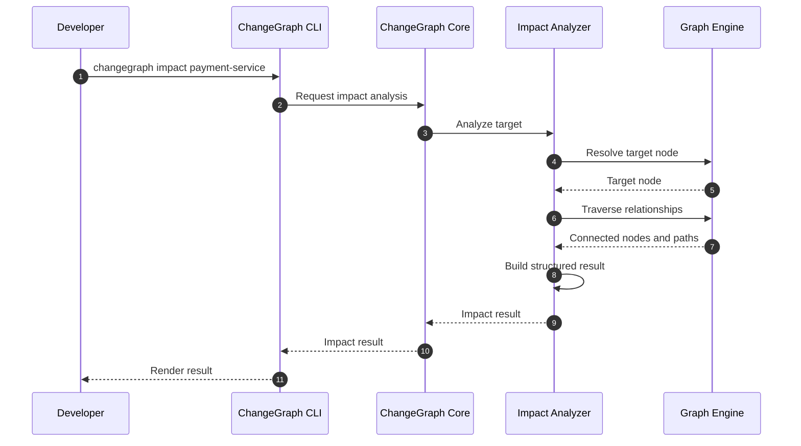

The same analysis operation must be reusable by other interfaces.

For example:

```text
CLI
HTTP API
gRPC API
future SDK integrations
```

should all rely on the same core analysis behavior.

---

## 13. V0.1 Graph Scope

V0.1 focuses on proving the fundamental graph and impact-analysis workflow.

V0.1 includes:

- Directed nodes and edges
- Stable node identity
- Initial relationship types
- Telemetry-derived relationship extraction
- Graph updates from observations
- Deterministic traversal
- Upstream analysis
- Downstream analysis
- Direct dependency analysis
- Transitive traversal
- Structured impact results
- CLI access to graph analysis

V0.1 does not require:

- Distributed graph storage
- Historical graph versioning
- AI-generated impact predictions
- Probabilistic risk scoring
- Full StatePack capture
- State restoration
- Deterministic application replay

These capabilities can be introduced without changing the fundamental node/edge graph model.
