# ChangeGraph OpenTelemetry Integration

## 1. Overview

ChangeGraph uses OpenTelemetry as its primary telemetry interoperability layer.

OpenTelemetry provides standardized instrumentation, context propagation, and telemetry transport. ChangeGraph consumes the resulting telemetry and transforms relevant observations into dependency relationships that can be represented in the ChangeGraph graph.

The integration boundary is:

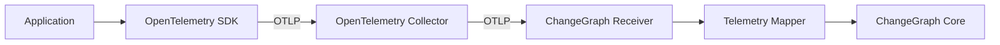

ChangeGraph does not attempt to replace OpenTelemetry.

Its responsibility begins when telemetry enters the ChangeGraph ingestion pipeline.

---

## 2. Integration Goals

The OpenTelemetry integration has several goals.

### 2.1 Language Interoperability

Applications written in different languages can participate through their existing OpenTelemetry instrumentation.

Initial examples include:

- Node.js
- PHP / Laravel
- Python / FastAPI

The same architecture can support other OpenTelemetry-compatible ecosystems.

### 2.2 Standardized Transport

The primary telemetry transport is OTLP.

This allows ChangeGraph to consume telemetry without creating a proprietary telemetry transport for every supported language.

### 2.3 Dependency Discovery

Relevant telemetry attributes are interpreted as evidence of relationships between application components.

Examples include:

- Service-to-service calls
- Service-to-database reads
- Service-to-database writes
- Event publishing
- Event consumption
- RPC communication

### 2.4 Separation from Impact Analysis

OpenTelemetry integration is responsible for receiving and interpreting telemetry.

Impact analysis remains the responsibility of the ChangeGraph core.

The separation is:

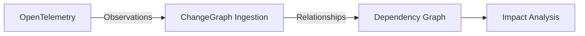

---

## 3. OpenTelemetry Boundary

ChangeGraph distinguishes between telemetry interoperability and dependency analysis.

OpenTelemetry provides:

- Instrumentation
- Traces
- Spans
- Context
- Resource information
- Attributes
- Events
- OTLP transport

ChangeGraph provides:

- Relationship extraction
- Dependency graph construction
- Graph traversal
- Impact analysis

The conceptual boundary is:

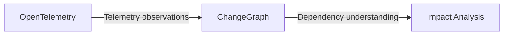

ChangeGraph should consume standardized telemetry where possible instead of requiring application developers to manually describe every observed relationship.

---

## 4. Telemetry Data Flow

The primary ingestion flow is:

```mermaid
flowchart LR
    APP["Application"]
    SDK["OpenTelemetry SDK"]
    COL["OpenTelemetry Collector"]
    REC["ChangeGraph Receiver"]
    SPAN["Telemetry Span"]
    SEM["Semantic Mapping"]
    EXTRACT["Relationship Extraction"]
    GRAPH["Dependency Graph"]

    APP --> SDK
    SDK -->|OTLP| COL
    COL -->|OTLP| REC
    REC --> SPAN
    SPAN --> SEM
    SEM --> EXTRACT
    EXTRACT -->|Node / Edge| GRAPH
```

The stages are:

1. Application creates telemetry.
2. OpenTelemetry SDK records spans and related context.
3. Telemetry is exported using OTLP.
4. The OpenTelemetry Collector can receive and forward telemetry.
5. ChangeGraph receives the telemetry.
6. Relevant attributes are normalized.
7. Semantic mapping identifies dependency information.
8. Relationship extraction produces graph relationships.
9. The graph engine creates or updates graph nodes and edges.

---

## 5. Receiver

The receiver is the entry point for telemetry entering ChangeGraph.

Its responsibilities are:

- Accept supported OTLP telemetry.
- Validate incoming telemetry.
- Pass normalized telemetry to the ingestion pipeline.
- Avoid implementing graph traversal or impact analysis.

The receiver should remain an adapter around the core ingestion model.

Conceptually:

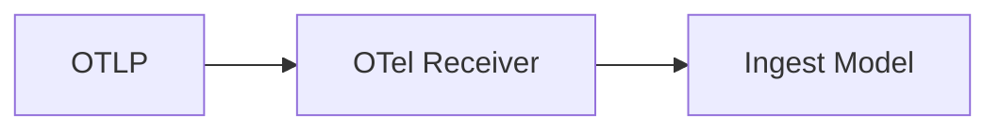

The receiver should not contain application-specific dependency rules.

---

## 6. Telemetry Mapper

The telemetry mapper converts OpenTelemetry structures into ChangeGraph's internal ingestion representation.

The mapping process is:

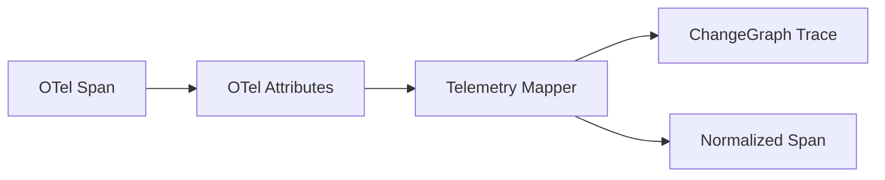

The mapper should preserve useful observation metadata while separating protocol-specific structures from the core graph model.

The result can then be consumed by the ingestion and relationship-extraction layers.

---

## 7. Semantic Mapping

Semantic mapping determines which OpenTelemetry information can be interpreted as dependency information.

The mapping is based on available telemetry attributes and semantic conventions.

### 7.1 Service Identity

A service identity can be derived from service resource information such as:

```text
service.name
```

Conceptually:

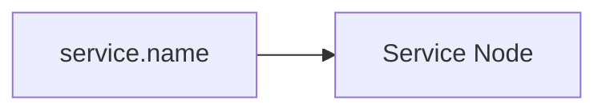

Example:

```text
service.name = order-service
```

can identify:

```text
order-service
```

as a graph node.

---

## 8. HTTP and RPC Relationships

HTTP or RPC telemetry can provide evidence of communication between components.

A simplified interpretation is:

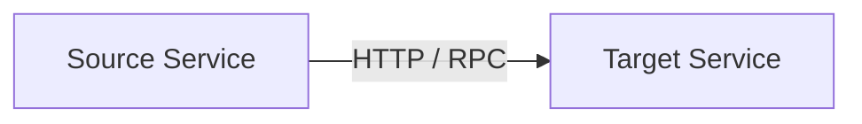

For example, telemetry describing a request from `order-service` to `payment-service` can produce:

```text
order-service --calls--> payment-service
```

The exact relationship must be based on sufficient telemetry evidence rather than merely assuming that every HTTP span represents a durable dependency.

---

## 9. Database Relationships

Database telemetry can provide evidence that a service reads from or writes to a database resource.

For example:

```text
service.name = order-service
db.system = postgresql
db.operation.name = INSERT
```

can be interpreted as:

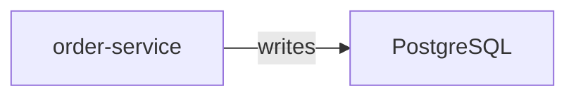

A read operation can produce:

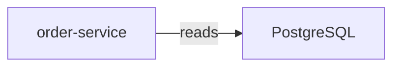

Additional database attributes can refine the target resource when sufficient information is available.

The mapper must avoid inventing resource precision that telemetry does not provide.

---

## 10. Messaging Relationships

Messaging telemetry can provide evidence for event or message relationships.

A publishing operation can be represented as:

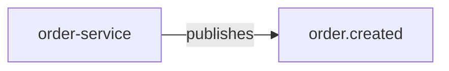

A consumer can be represented as:

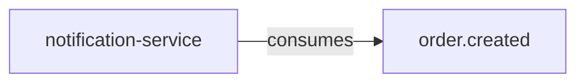

The target identity should be derived from available messaging metadata.

If the telemetry does not provide enough information to uniquely identify a resource, the mapper should retain the available identity instead of fabricating one.

---

## 11. Relationship Extraction

Relationship extraction converts normalized telemetry into graph relationships.

The process is:

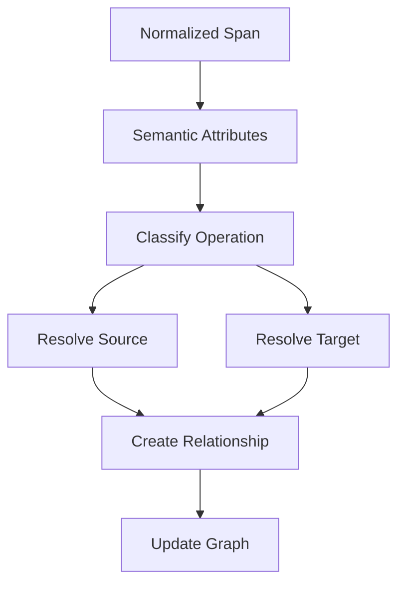

Initial relationship types include:

- `calls`
- `reads`
- `writes`
- `publishes`
- `consumes`
- `depends_on`

The first five can be derived from observed telemetry when sufficient evidence exists.

`depends_on` may be supplied through explicit metadata or other ChangeGraph-specific mechanisms when a business dependency cannot be inferred from a direct telemetry operation.

---

## 12. Observation and Relationship Deduplication

Multiple telemetry spans may represent the same underlying dependency.

For example, a service may execute thousands of database queries:

```text
order-service
      │
      ├── Span 1 ──> PostgreSQL
      ├── Span 2 ──> PostgreSQL
      ├── Span 3 ──> PostgreSQL
      └── Span N ──> PostgreSQL
```

The graph should not blindly create a separate logical dependency edge for every span.

Instead, observations should contribute evidence to a normalized relationship:

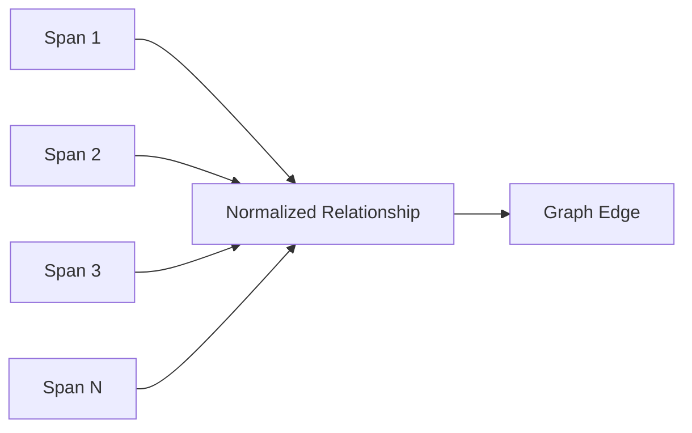

Observation metadata can remain associated with the relationship without changing the graph's logical topology.

---

## 13. Trace Correlation

Trace context is important for connecting telemetry observations.

A simplified relationship is:

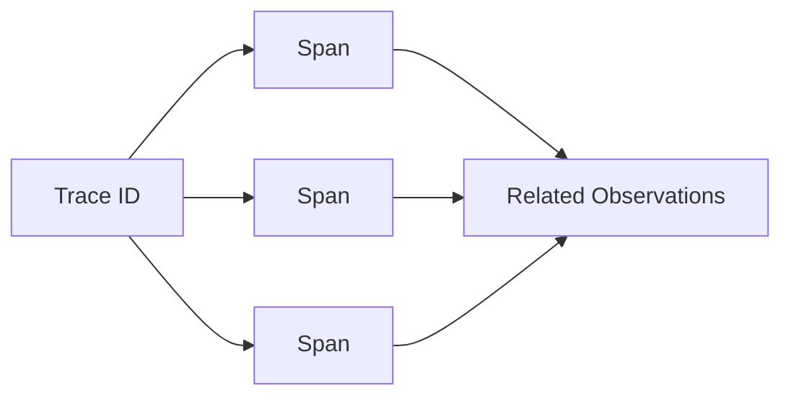

Trace correlation allows ChangeGraph to understand that multiple spans belong to the same execution context.

The Trace ID can later also serve as a correlation point for StatePack.

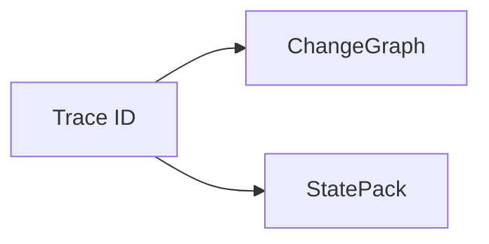

StatePack capture and replay are future capabilities and are not required for V0.1.

---

## 14. Sequence: Telemetry Ingestion

The complete ingestion sequence is:

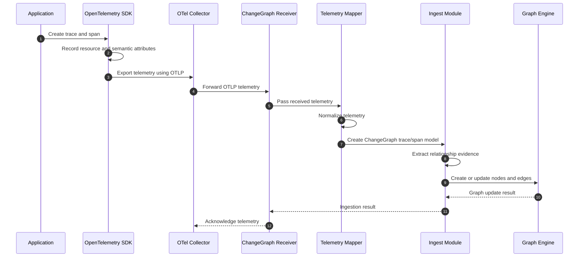

The ingestion path must not invoke impact analysis as part of normal telemetry ingestion.

Impact analysis is a separate operation performed against the resulting graph.

---

## 15. Semantic Mapping Principles

Semantic mapping follows several principles.

### Prefer Standard Attributes

Use OpenTelemetry semantic conventions when sufficient information exists.

### Preserve Evidence

The system should retain useful observation metadata so relationships can be traced back to their source observations.

### Do Not Invent Precision

If telemetry only identifies a database system, ChangeGraph should not claim that a specific table was accessed unless the telemetry provides sufficient evidence.

### Normalize

Different telemetry representations of the same dependency should resolve to a consistent graph representation.

### Keep Mapping Extensible

New semantic conventions and resource types should be addable without redesigning the core graph model.

---

## 16. OTel and ChangeGraph Responsibilities

The boundary can be summarized as follows:

| Responsibility | OpenTelemetry | ChangeGraph |
|---|---:|---:|
| Application instrumentation | Yes | No |
| Trace creation | Yes | No |
| Span creation | Yes | No |
| Context propagation | Yes | No |
| Telemetry transport | Yes | Receives |
| Semantic attributes | Yes | Interprets |
| Relationship extraction | No | Yes |
| Dependency graph | No | Yes |
| Impact analysis | No | Yes |
| StatePack correlation | Context source | Uses |

ChangeGraph should not duplicate functionality that OpenTelemetry already standardizes.

---

## 17. V0.1 Scope

V0.1 focuses on establishing the telemetry-to-graph pipeline.

V0.1 includes:

- OpenTelemetry-compatible ingestion architecture
- OTLP ingestion boundary
- Trace and span normalization
- Service identity mapping
- Initial HTTP/RPC relationship mapping
- Initial database relationship mapping
- Initial messaging relationship mapping
- Relationship extraction
- Relationship normalization
- Graph updates
- Trace correlation
- Integration fixtures and tests

V0.1 does not require:

- Complete support for every OpenTelemetry semantic convention
- Every database technology
- Every messaging system
- Automatic discovery of every possible business dependency
- Full StatePack capture
- State restoration
- Replay
- AI-based semantic inference

Unsupported or ambiguous telemetry should be handled conservatively rather than producing unsupported graph relationships.

---

## 18. Future Extensions

The integration can later be extended with:

- Additional OpenTelemetry semantic conventions
- More resource types
- Custom ChangeGraph relationship declarations
- Framework-specific adapters
- Additional telemetry sources
- Historical graph reconstruction
- StatePack correlation
- Advanced dependency confidence analysis

These extensions should preserve the core boundary:

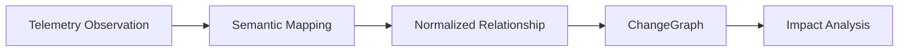

The OpenTelemetry integration remains an observation-to-relationship adapter, while the graph and impact engine remains independent of the telemetry transport.
