# ChangeGraph Protocol

## 1. Overview

ChangeGraph uses explicit protocol contracts to support interoperability between its components and language ecosystems.

The protocol layer defines structured contracts for:

- Graph data
- Telemetry ingestion models
- StatePack metadata and format

The protocol specifications are stored under:

- `specs/graph/graph.proto`
- `specs/ingest/ingest.proto`
- `specs/statepack/statepack.proto`

These specifications define the wire-level contracts. Internal Rust domain models remain separate from generated protocol types.

---

## 2. Protocol Architecture

ChangeGraph has two important interoperability boundaries.

The first is the OpenTelemetry boundary, which handles application telemetry.

The second is the ChangeGraph Protocol boundary, which handles ChangeGraph-specific representations and communication.

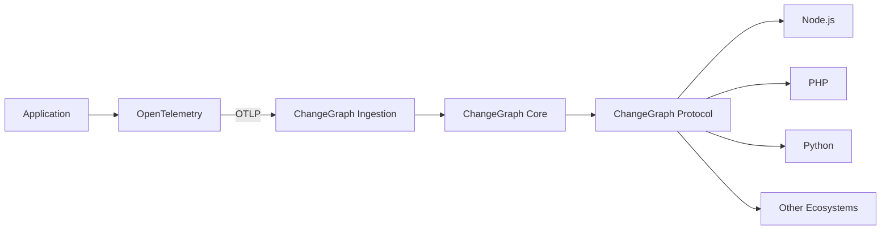

The two protocol domains have different responsibilities:

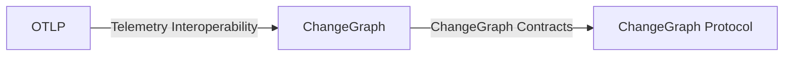

OTLP should not be reimplemented as a ChangeGraph-specific protocol.

---

## 3. Why Protocol Buffers

ChangeGraph uses Protocol Buffers for its protocol definitions.

The primary reasons are:

- Cross-language code generation
- Explicit schemas
- Compact binary representation
- Strongly typed messages
- Explicit field numbering
- Versionable contracts
- Broad ecosystem support
- Compatibility with gRPC

The protocol is intended to be consumed by multiple languages without requiring every implementation to understand the internal Rust representation.

The architecture therefore separates:

```text
Protocol Model
        ↓
Protocol Mapping
        ↓
Internal Domain Model
```

The protocol is a contract, not the domain implementation itself.

---

## 4. Protocol Boundaries

The protocol layer should maintain clear boundaries between external representations and internal models.

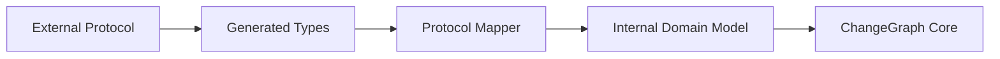

The core should operate on internal domain models rather than coupling graph logic directly to generated Protobuf structures.

This allows the protocol schema to evolve without forcing the entire graph engine to depend on wire-format details.

---

## 5. Graph Protocol

The Graph Protocol defines the structured representation of ChangeGraph graph entities.

Specification:

```text
specs/graph/graph.proto
```

Its conceptual responsibilities include:

- Node representation
- Edge representation
- Relationship type representation
- Graph metadata
- Graph query or result structures where required

The Graph Protocol represents graph information at the interoperability boundary.

The internal graph implementation remains responsible for graph storage and traversal.

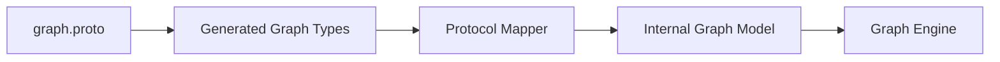

---

## 6. Ingest Protocol

The Ingest Protocol defines ChangeGraph-specific ingestion structures.

Specification:

```text
specs/ingest/ingest.proto
```

It provides a contract between ingestion boundaries and the ChangeGraph ingestion model where a ChangeGraph-specific representation is required.

The ingestion architecture is:

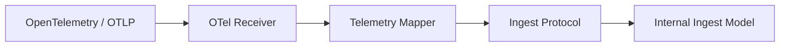

The Ingest Protocol does not replace OTLP.

OTLP remains the telemetry interoperability mechanism.

The ChangeGraph Ingest Protocol defines the representation used by ChangeGraph-specific ingestion boundaries.

---

## 7. StatePack Protocol

The StatePack Protocol defines the interoperable representation of StatePack metadata and format-related structures.

Specification:

```text
specs/statepack/statepack.proto
```

Its purpose is to provide a stable contract between StatePack producers, consumers, and future implementations across languages.

The conceptual relationship is:

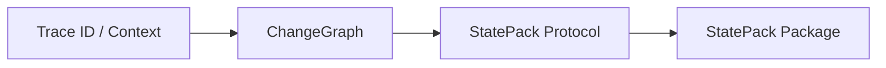

StatePack capture, restoration, and replay are planned capabilities beyond V0.1.

The protocol is defined early so future implementations can evolve around an explicit contract rather than an undocumented private format.

---

## 8. Protocol to Domain Mapping

Generated Protobuf types should not become the core domain model.

For example:

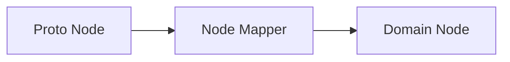

The same principle applies to edges:

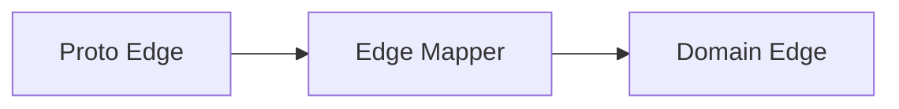

This separation provides several benefits:

- Domain logic remains protocol-independent.
- Protocol changes can be isolated to mapping code.
- Generated code can be regenerated safely.
- Internal invariants can be enforced before data reaches the graph engine.

---

## 9. API Contracts

The ChangeGraph API layer exposes capabilities through HTTP and gRPC.

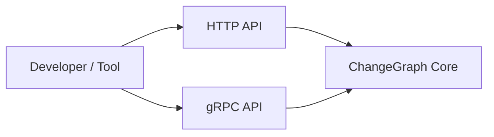

The API layer is an adapter over the core.

API handlers should not implement independent graph traversal or impact-analysis logic.

The expected dependency direction is:

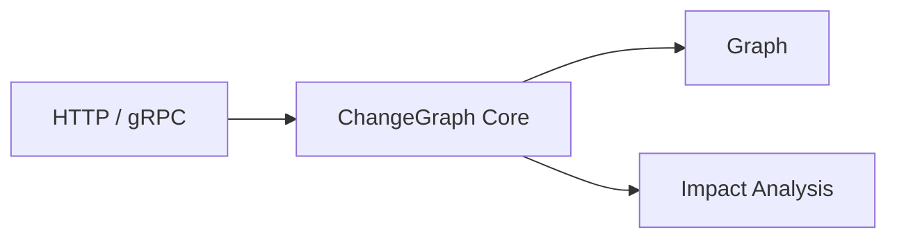

The same domain operation should produce equivalent results regardless of whether it is accessed through CLI, HTTP, or gRPC.

---

## 10. CLI and Protocol Usage

The CLI is another interface over the same core.

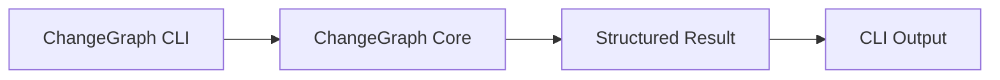

The CLI should not bypass the core by directly implementing protocol-specific graph behavior.

When protocol-based communication is required, the CLI should use the appropriate API or core interface while keeping presentation concerns in the CLI layer.

---

## 11. Schema Versioning

Protocol schemas must be designed for evolution.

The following principles apply:

### Preserve Field Numbers

Existing Protobuf field numbers must not be reused for unrelated meanings.

### Prefer Additive Changes

Adding optional fields is generally safer than changing the meaning of an existing field.

### Do Not Change Semantic Meaning Silently

A field that previously represented one concept should not later represent a different concept while retaining the same field identity.

### Reserve Removed Fields

When a field is permanently removed, its field number and, where appropriate, its name should be reserved to prevent accidental reuse.

### Version Explicitly

Protocol-level compatibility should be distinguishable from application or package versions.

A ChangeGraph implementation may therefore have:

```text
ChangeGraph release version
Protocol version
StatePack format version
```

These versions should not be assumed to be identical.

---

## 12. Backward Compatibility

Backward compatibility means that a newer implementation can continue to understand data produced by an older compatible implementation.

The protocol should favor additive evolution.

Conceptually:

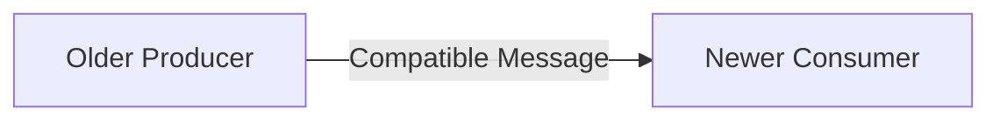

When a new field is introduced, older consumers should be able to ignore it when the schema semantics permit that behavior.

Compatibility must be evaluated at the protocol level rather than assumed from the software release version.

---

## 13. Forward Compatibility

Forward compatibility concerns older consumers encountering data produced by newer implementations.

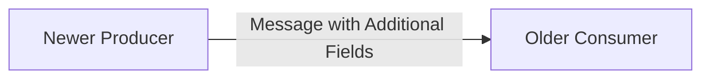

Unknown fields should not cause the consumer to corrupt or misinterpret the rest of a valid message.

However, forward compatibility does not mean that an old implementation can understand a completely new semantic concept.

When a new concept changes the meaning of an existing operation, a protocol version or explicitly versioned feature may be required.

---

## 14. Compatibility Rules

The following rules apply to protocol evolution:

- Do not reuse field numbers.
- Do not silently change field semantics.
- Prefer additive schema changes.
- Reserve removed fields.
- Keep protocol versioning explicit.
- Separate software release versions from protocol versions.
- Maintain compatibility tests for supported protocol versions.
- Treat breaking protocol changes as intentional version boundaries.

Protocol changes should be reviewed as API changes, not merely as internal refactors.

---

## 15. Serialization and Transport

Protocol Buffers define message structure.

Transport is a separate concern.

For example:

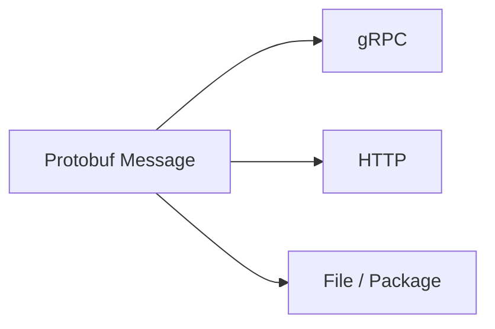

A Protobuf message does not inherently require gRPC.

This separation allows the same schema to be used across different transport or storage boundaries where appropriate.

---

## 16. Protocol and OpenTelemetry Relationship

ChangeGraph should preserve a clear boundary between OTLP and ChangeGraph-specific protocols.

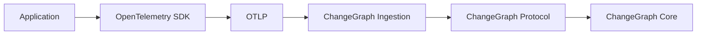

OTLP describes telemetry transport and OpenTelemetry data.

ChangeGraph Protocol describes ChangeGraph-specific representations.

This distinction allows ChangeGraph to remain compatible with the OpenTelemetry ecosystem without making OpenTelemetry responsible for ChangeGraph's graph semantics.

---

## 17. V0.1 Protocol Scope

V0.1 establishes the protocol foundation.

V0.1 includes:

- Graph Protocol definition
- Ingest Protocol definition
- StatePack Protocol definition
- Protobuf-based schemas
- Internal protocol mapping boundary
- API contract direction
- Protocol versioning principles
- Compatibility rules
- Initial protocol tests

V0.1 does not require:

- A stable public protocol guarantee for every message
- Long-term compatibility across all future releases
- Complete StatePack wire implementation
- Every possible graph query encoded in Protobuf
- Every language binding generated and published

Protocol stability should be increased deliberately as the project approaches a public release.

---

## 18. Protocol Evolution

The intended evolution path is:

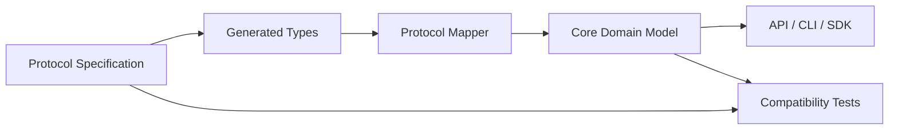

The specification remains the source of truth for wire contracts.

Generated code should be treated as an implementation artifact rather than the primary place where protocol semantics are defined.

Future language ecosystems can generate their own protocol bindings from the same specifications.

---

## 19. Protocol Design Principles

### Explicit Contracts

Every cross-component message should have a defined schema.

### Stable Semantics

Field names and numbers are not enough. The meaning of each field must remain explicit.

### Language Neutrality

The protocol must not encode assumptions specific to Rust, Node.js, PHP, or Python.

### Transport Independence

Message definitions should remain usable across supported transports.

### Domain Separation

Generated protocol types should remain separate from internal domain models.

### Evolution Safety

Schema changes must consider backward and forward compatibility before implementation.

---

## 20. Future Extensions

The protocol system can later support:

- Additional graph resource types
- Richer relationship metadata
- Graph snapshots
- Historical graph versions
- Streaming graph updates
- StatePack capture metadata
- StatePack package manifests
- Additional language bindings
- Protocol capability negotiation

These extensions should preserve the core principle:

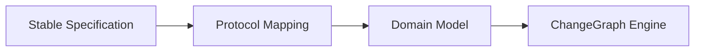

The protocol exists to make ChangeGraph interoperable. It should not dictate how the internal engine implements graph storage, traversal, or impact analysis.
