# ChangeGraph StatePack

## 1. Overview

StatePack is a complementary component of the ChangeGraph ecosystem designed to preserve relevant application state so that behavior observed in a real execution can be restored and replayed in a controlled environment.

ChangeGraph and StatePack solve different but connected problems:

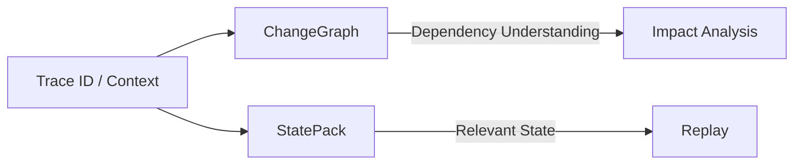

ChangeGraph answers:

> What components are related and potentially affected?

StatePack is intended to answer:

> What relevant state existed when this behavior occurred?

StatePack therefore extends the ChangeGraph ecosystem from dependency understanding toward incident reproduction.

---

## 2. Architectural Position

StatePack is intentionally separated from the ChangeGraph graph engine.

The relationship is based primarily on trace and execution context.

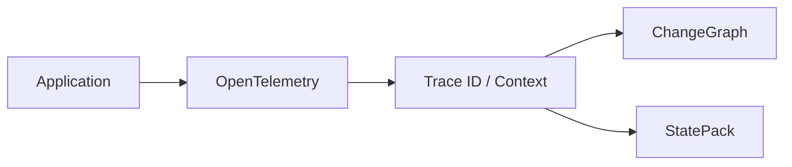

ChangeGraph should not become responsible for capturing arbitrary application state.

Likewise, StatePack should not become responsible for graph traversal or impact analysis.

The separation is:

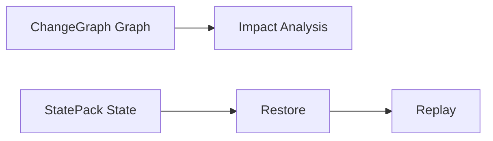

This keeps both components independently evolvable.

---

## 3. Problem

Production failures are often difficult to reproduce because the original execution depends on state that no longer exists.

Relevant state can include:

- Request context
- Trace context
- Database state
- Cache state
- Events or messages
- External responses
- Feature flags
- Runtime metadata

A useful StatePack should preserve enough relevant information to reproduce behavior without attempting to capture an uncontrolled copy of an entire production environment.

The intended workflow is:

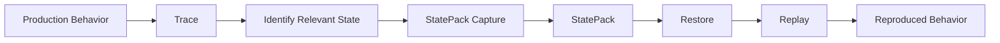

---

## 4. StatePack Lifecycle

The long-term StatePack lifecycle is:

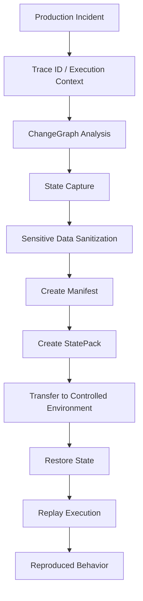

The lifecycle consists of:

1. Identify a relevant execution.
2. Correlate the execution using trace context.
3. Determine which state is relevant.
4. Capture the required state.
5. Sanitize sensitive information.
6. Create the StatePack manifest.
7. Package the state and metadata.
8. Transfer the package to a controlled environment.
9. Restore the captured state.
10. Replay the relevant execution.
11. Compare the resulting behavior with the original observation.

Full capture, restore, and replay are planned capabilities beyond V0.1.

---

## 5. StatePack Package

A StatePack is a versioned package containing state data and metadata required by the StatePack format.

Conceptually:

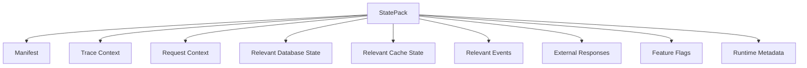

The exact binary or archive representation is a format concern.

The conceptual StatePack model should remain independent from the storage mechanism.

For example, a future implementation could store a StatePack as an archive containing structured metadata and state payloads without changing the logical model.

---

## 6. Manifest

The manifest provides metadata describing the StatePack.

A conceptual manifest contains:

```text
StatePack Manifest
- format version
- trace ID
- creation timestamp
- source service
- execution metadata
- state entries
- integrity metadata
```

The manifest should allow a consumer to understand a StatePack without immediately restoring every payload.

A simplified representation is:

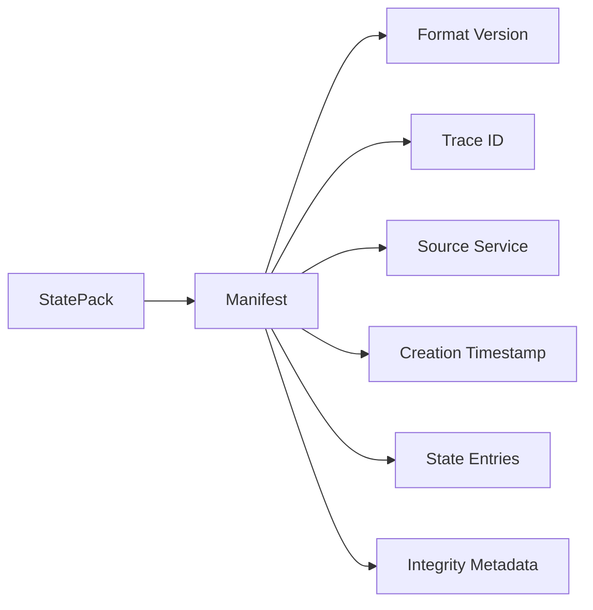

The manifest version is separate from the ChangeGraph software release version.

---

## 7. State Entries

A StatePack should represent captured state as explicit entries.

Conceptually:

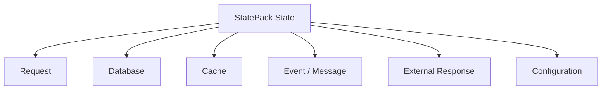

Each entry should have enough metadata to identify:

- State category
- Resource identity
- Capture source
- Content representation
- Integrity information
- Sensitivity classification where applicable

The exact representation is part of the StatePack format specification.

---

## 8. Request State

Request state represents the information required to reproduce the relevant application request.

Potential information includes:

- HTTP method
- Request path
- Query parameters
- Relevant headers
- Request body
- Trace context

Not every request field should automatically be captured.

Capture should be scoped to the reproduction goal and subject to sanitization rules.

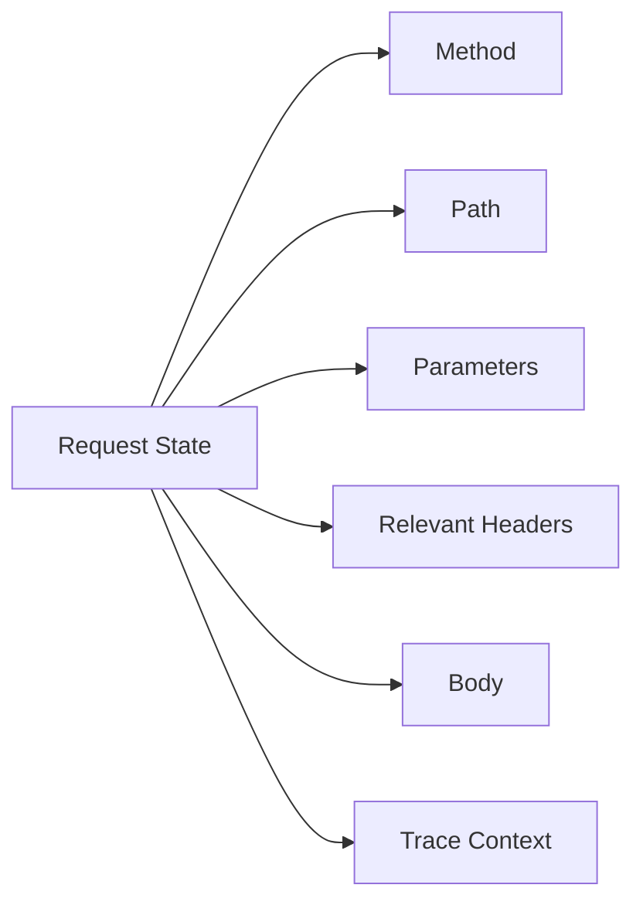

---

## 9. Database State

Database state represents the data required to reproduce the relevant execution.

StatePack should avoid assuming that the entire production database must be copied.

The intended model is selective state capture:

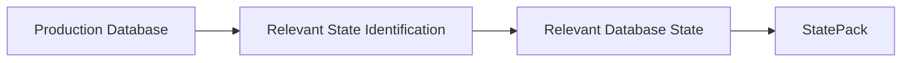

The captured state may eventually be represented as:

- Selected rows
- Selected tables
- Schema metadata
- Transaction context
- Other database-specific state required for replay

The exact mechanism is implementation-dependent and is not fully defined in V0.1.

---

## 10. Cache State

Cache state may influence application behavior and can therefore be relevant to reproduction.

Examples include:

- Key/value entries
- Expiration metadata
- Namespace information
- Relevant cache configuration

The intended flow is:

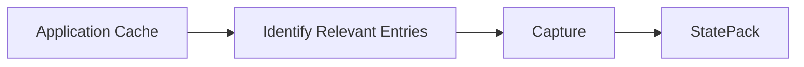

Only relevant state should be captured.

---

## 11. Event and Message State

Distributed applications may depend on events or messages observed during an execution.

A StatePack may eventually preserve relevant event or message information:

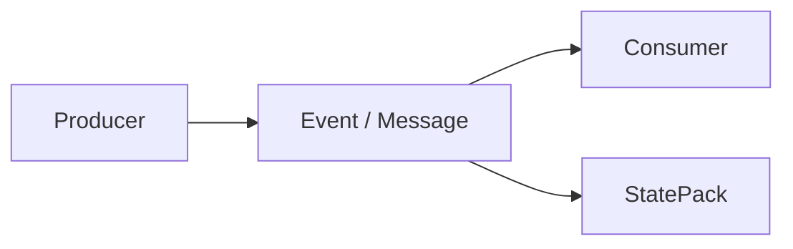

Potential information includes:

- Event type
- Message identifier
- Destination
- Payload
- Relevant headers
- Ordering information

The StatePack format must distinguish captured message data from the graph relationship that describes the dependency.

---

## 12. External Responses

Applications often depend on external services.

Replaying the original behavior may require reproducing the response returned by an external dependency.

The intended model is:

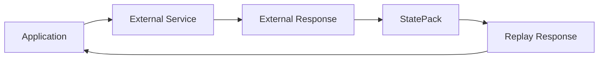

StatePack should preserve the relevant response in a form that can be replayed without requiring the production external service to behave identically.

The exact replay mechanism is a future implementation concern.

---

## 13. Feature Flags and Configuration

Application behavior can depend on configuration and feature flags.

Relevant configuration may therefore become part of a StatePack:

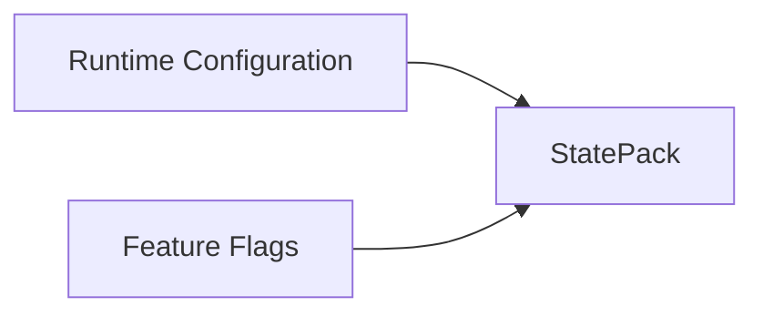

Only configuration relevant to the captured execution should be included.

Secrets and credentials must never be copied into a StatePack without explicit and secure handling.

---

## 14. Capture

Capture is responsible for collecting the state required to reproduce an execution.

The conceptual process is:

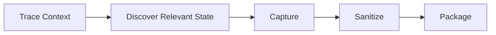

Capture should be selective rather than indiscriminate.

The objective is:

> Capture enough state to reproduce the relevant behavior while minimizing unnecessary data.

This reduces package size, security exposure, and restoration complexity.

---

## 15. Restore

Restore prepares a controlled environment using StatePack contents.

The conceptual process is:

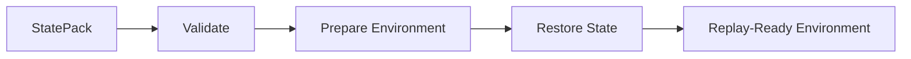

Restore must validate the StatePack before applying its contents.

A future implementation should be able to detect:

- Unsupported format versions
- Invalid manifests
- Corrupted payloads
- Missing dependencies
- Incompatible runtime requirements

---

## 16. Replay

Replay executes the relevant request or event against the restored state.

The intended workflow is:

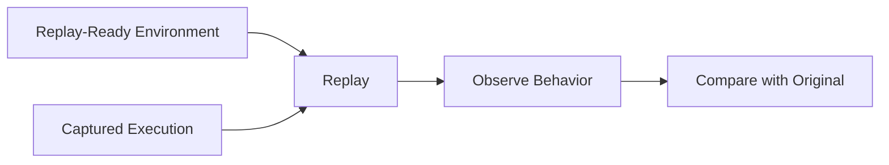

Replay should be designed as a controlled execution rather than an attempt to reproduce an entire production environment.

The objective is to reproduce the relevant behavior with sufficient fidelity for debugging and analysis.

---

## 17. Integrity

A StatePack must provide mechanisms for detecting accidental or unauthorized modification.

Potential integrity information includes:

- Content hashes
- Package hashes
- Manifest integrity metadata
- Payload checksums

The conceptual model is:

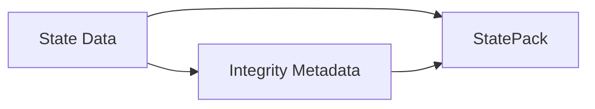

Integrity verification should happen before restoration.

---

## 18. Security and Sanitization

StatePack can contain sensitive application data.

Security is therefore a core architectural concern.

Potentially sensitive information includes:

- Authentication tokens
- Session data
- Personal information
- Credentials
- API keys
- Database records
- Request headers
- External service responses

The capture pipeline should include sanitization before packaging:

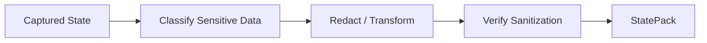

StatePack must not be treated as a safe artifact merely because it is intended for debugging.

A StatePack should be handled as sensitive data unless its contents have been explicitly classified otherwise.

---

## 19. Isolation

Restoration and replay should occur in a controlled environment.

The intended boundary is:

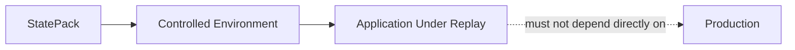

Replay should not accidentally send captured requests to production dependencies.

Future implementations should provide explicit controls for external dependency isolation.

---

## 20. Format Versioning

StatePack format versions must be independent from ChangeGraph software versions.

For example:

```text
ChangeGraph release: 0.2.0
StatePack format: 1
```

A future ChangeGraph release may support multiple StatePack format versions.

The format must evolve using explicit compatibility rules.

```mermaid
flowchart LR
    V1["StatePack Format v1"]
    V2["StatePack Format v2"]
    READER["StatePack Reader"]

    V1 --> READER
    V2 --> READER
```

Breaking format changes should receive a new format version rather than silently changing the meaning of an existing version.

---

## 21. StatePack and ChangeGraph Correlation

Trace context is the primary correlation point between the two components.

```mermaid
flowchart LR
    TRACE["Trace ID"]
    SPANS["Observed Spans"]
    GRAPH["ChangeGraph"]
    STATE["StatePack"]

    TRACE --> SPANS
    SPANS --> GRAPH
    TRACE --> STATE
```

This allows a debugging workflow such as:

```mermaid
flowchart LR
    TRACE["Trace"]
    IMPACT["Impact Analysis"]
    STATE["StatePack"]
    REPLAY["Replay"]

    TRACE --> IMPACT
    TRACE --> STATE
    IMPACT --> STATE
    STATE --> REPLAY
```

The graph can help determine which components are relevant before a StatePack capture is performed.

---

## 22. V0.1 Scope

StatePack is intentionally limited in V0.1.

V0.1 establishes:

- StatePack concept
- StatePack architectural boundary
- Protocol definition
- Manifest concept
- Format versioning principles
- Trace correlation model
- Security and sanitization requirements
- Future capture/restore/replay architecture

V0.1 does not require:

- Production database snapshot capture
- Automatic cache capture
- Automatic event capture
- External response recording
- State restoration
- Deterministic replay
- Complete StatePack packaging implementation
- Full production security workflow

The StatePack directories and protocol exist as architectural foundations for future versions.

---

## 23. V0.2+ Direction

Future StatePack implementation can progressively add:

```mermaid
flowchart LR
    V01["V0.1 Foundation"]
    CAPTURE["Capture"]
    RESTORE["Restore"]
    REPLAY["Replay"]
    COMPARE["Behavior Comparison"]

    V01 --> CAPTURE
    CAPTURE --> RESTORE
    RESTORE --> REPLAY
    REPLAY --> COMPARE
```

A possible evolution path is:

1. Define and validate the StatePack format.
2. Implement manifest creation.
3. Implement controlled capture.
4. Add sanitization and integrity verification.
5. Implement restoration.
6. Implement replay.
7. Add behavior comparison and debugging workflows.

Each stage should preserve compatibility with the protocol and format contracts established earlier.

---

## 24. Architectural Principles

### Selective Capture

Capture only state relevant to the reproduction objective.

### Trace Correlation

Use trace context to connect StatePack data with observed execution.

### Isolation

Restore and replay in controlled environments.

### Security by Default

Treat captured state as sensitive until proven otherwise.

### Explicit Versioning

Version the StatePack format independently from ChangeGraph releases.

### Protocol Stability

Define the format through explicit contracts before building complex capture and replay mechanisms.

### Separation of Concerns

StatePack handles state preservation and replay concerns.

ChangeGraph handles dependency understanding and impact analysis.

Neither component should absorb the other's primary responsibilities.

---

## 25. Future Architecture

The long-term ChangeGraph ecosystem can connect dependency analysis with state reproduction:

```mermaid
flowchart LR
    APP["Application"]
    OTEL["OpenTelemetry"]
    CG["ChangeGraph"]
    GRAPH["Dependency Graph"]
    IMPACT["Impact Analysis"]
    TRACE["Historical Trace"]
    SP["StatePack"]
    RESTORE["Restore"]
    REPLAY["Replay"]

    APP --> OTEL
    OTEL --> CG
    CG --> GRAPH
    GRAPH --> IMPACT
    IMPACT --> TRACE
    TRACE --> SP
    SP --> RESTORE
    RESTORE --> REPLAY
```

The resulting workflow is intended to connect two questions:

```text
ChangeGraph: "What could this change affect?"
StatePack: "What state caused this behavior?"
```

Together, they provide a path from dependency discovery and impact analysis toward reproducible debugging.

This remains a future direction beyond the initial V0.1 implementation.
